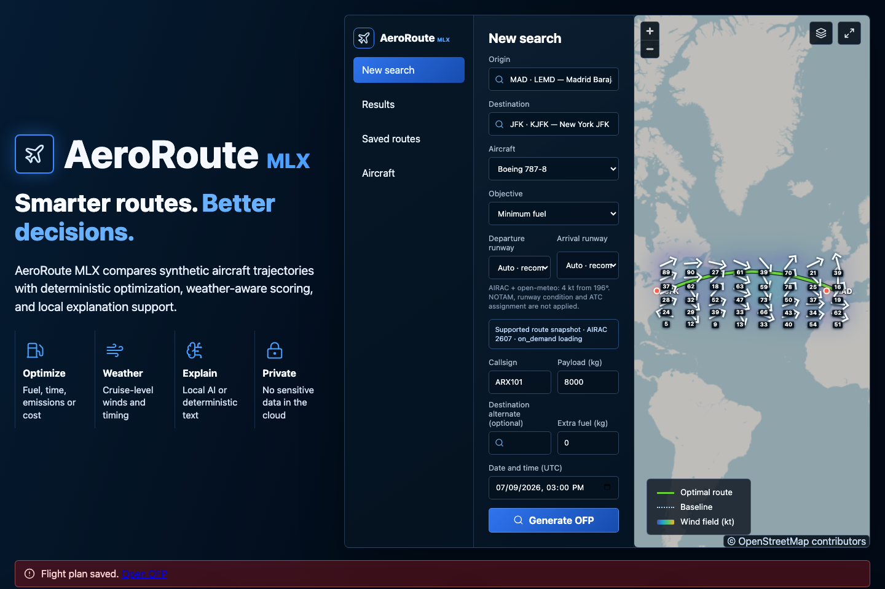
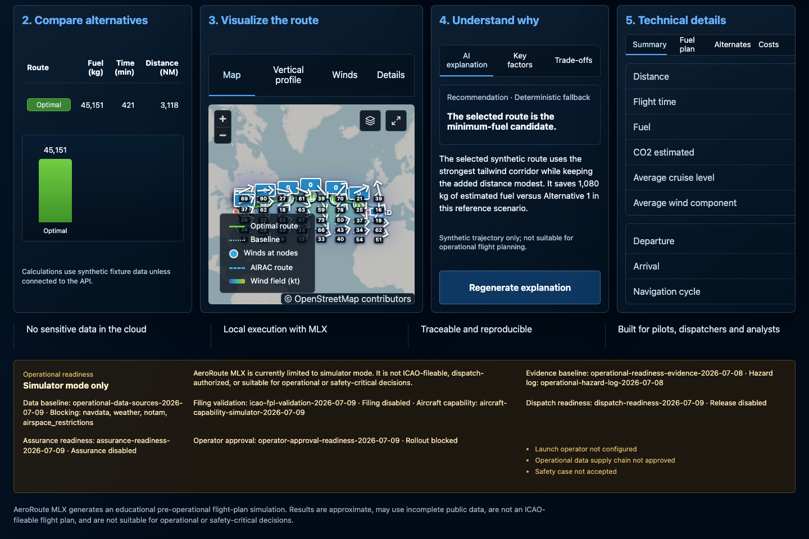
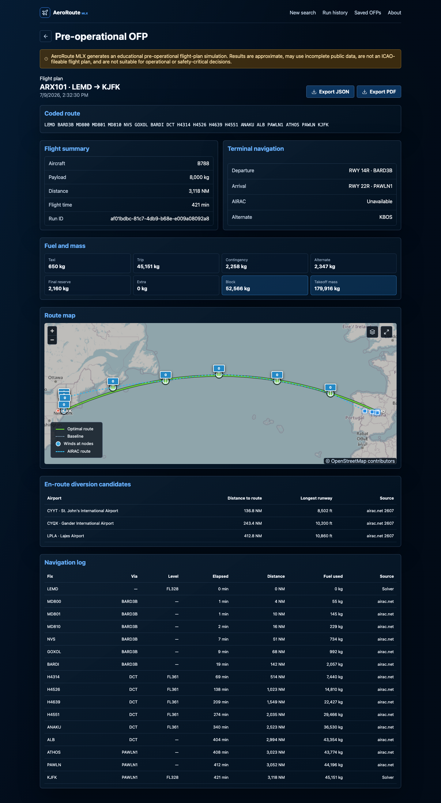
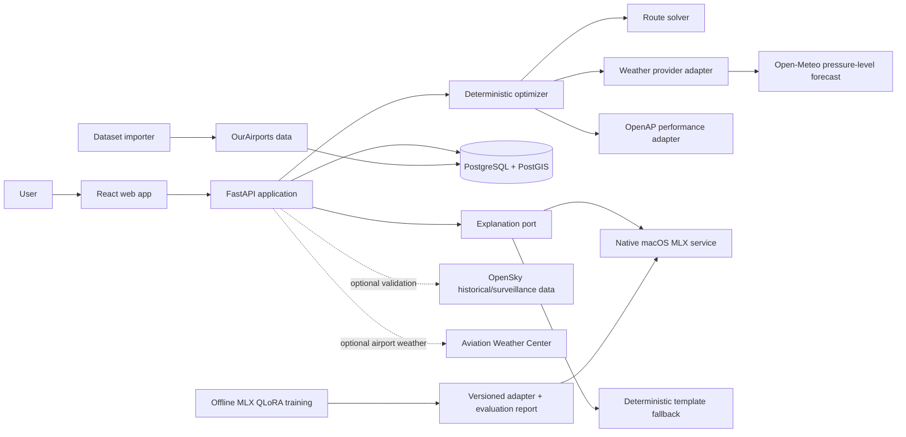

# AeroRoute MLX

An educational flight-trajectory efficiency simulator: a deterministic 4D
route optimizer, a PostGIS-backed FastAPI service, a React/MapLibre frontend,
and a locally-run Apple Silicon LLM that explains — but never computes —
the result.

> AeroRoute MLX generates an educational pre-operational flight-plan
> simulation. Results are approximate, may use incomplete public data, are not
> an ICAO-fileable flight plan, and are not suitable for operational or
> safety-critical decisions.

## What this project demonstrates

- **A deterministic core kept strictly separate from the LLM.** A custom
  layered label-setting solver computes routes, fuel, and scoring; the local
  language model only narrates an already-computed result and is
  contractually forbidden from inventing or recalculating a single number —
  enforced by output validators, not just a prompt instruction.
- **Local-first AI inference.** Explanations run on-device via [MLX](https://github.com/ml-explore/mlx)
  on Apple Silicon (Gemma 3 4B, 4-bit), with an automatic deterministic
  fallback when the model is unavailable — no user data ever leaves the
  machine for this feature.
- **A measured model bake-off, not a preference call.** The base model was
  chosen by running a 24-case evaluation corpus against three candidates and
  recording pass rate, latency, and memory — including a case where a
  challenger model failed a majority of cases, and documenting *why* rather
  than discarding the result quietly.
- **Fail-closed safety boundaries that are visible at runtime, not just in
  docs.** Every response and screen carries explicit "why this isn't
  operational" evidence (see the screenshots below) — filing, dispatch, and
  operator-approval gates are represented as real API fields with automated
  regression tests that fail if a future endpoint quietly weakens them.
- **A controlled multi-repository architecture.** Eight independently
  versioned repositories (web, API, optimizer, native MLX service, offline
  training, data curation, cross-language contracts, and this platform repo)
  with a pinned release manifest, coordinated system tags, and a guardrail
  that fails the build if any component's pinned version drifts from what's
  actually checked out.
- **Reproducibility as a first-class requirement.** Every optimization run
  freezes its algorithm version, dataset snapshot, and configuration; four
  reference routes are re-verified against a live stack before every release
  candidate.

## Screenshots

| Search & live route map | Comparison, explanation & safety gates |
| --- | --- |
|  |  |

<details>
<summary>Full pre-operational OFP (fuel/mass breakdown, navlog, diversions)</summary>



</details>

## Architecture



The full design (domain model, solver algorithm, geospatial edge cases,
testing strategy, and every architecture decision record) is in
[`docs/HLD.md`](docs/HLD.md) — the authoritative source; anything summarized
here is downstream of it.

## Repositories

| Repo | Owns |
| --- | --- |
| [`aeroroute-web`](https://github.com/jmiguelmangas/aeroroute-web) | React/TypeScript frontend, MapLibre route views, generated API client |
| [`aeroroute-api`](https://github.com/jmiguelmangas/aeroroute-api) | FastAPI orchestration, persistence, weather adapters, navigation/AIRAC integration |
| [`aeroroute-optimizer`](https://github.com/jmiguelmangas/aeroroute-optimizer) | Pure deterministic solver package — no HTTP, DB, or MLX dependency |
| [`aeroroute-mlx`](https://github.com/jmiguelmangas/aeroroute-mlx) | Native macOS MLX explanation service, constrained generation, deterministic fallback |
| [`aeroroute-mlx-training`](https://github.com/jmiguelmangas/aeroroute-mlx-training) | Offline dataset generation, model bake-offs, QLoRA experiments and evaluation |
| [`aeroroute-data`](https://github.com/jmiguelmangas/aeroroute-data) | Versioned airport catalogue curation and dataset manifests |
| [`aeroroute-contracts`](https://github.com/jmiguelmangas/aeroroute-contracts) | Cross-language OpenAPI/JSON Schema contracts |
| `aeroroute-platform` (this repo) | Local composition, release manifest, integration tests, docs |

## Running it locally

```bash
make bootstrap   # once
make dev-up      # PostgreSQL + PostGIS via Docker Compose
# in aeroroute-api: uv run alembic upgrade head && uv run aeroroute import-airports --bundle ...
make check       # repository-local validation
make verify-live # reproduce the frozen reference routes against the live stack
```

`make integration`, `make e2e`, and `make release-verify` compose and verify
the released sibling artifacts together. Native MLX explanations require
Apple Silicon; the system is fully usable without it (deterministic template
fallback).

## Operational status

Operational use (real ICAO filing, dispatch authorization) is an explicit,
separate, currently-blocked post-MVP program — tracked in
[`docs/OPERATIONAL_READINESS_PLAN.md`](docs/OPERATIONAL_READINESS_PLAN.md).
Do not remove the non-operational disclaimer until an operator-specific
approval path, licensed operational data, safety case, verification
evidence, and manual/procedure acceptance exist.
