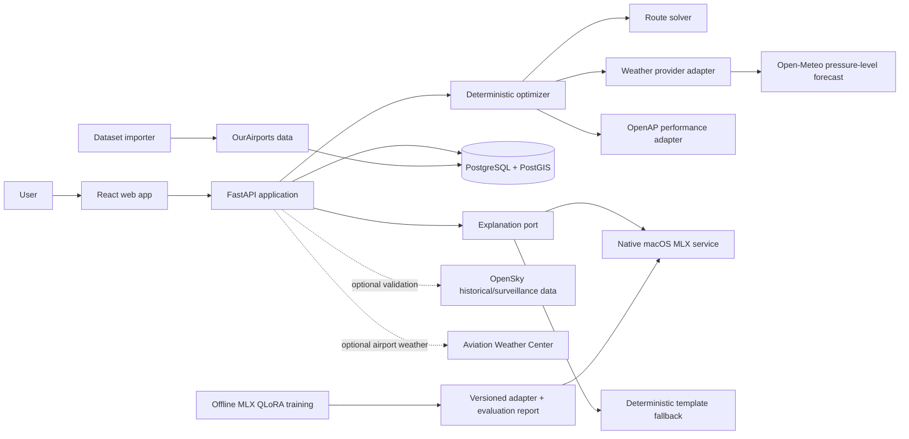
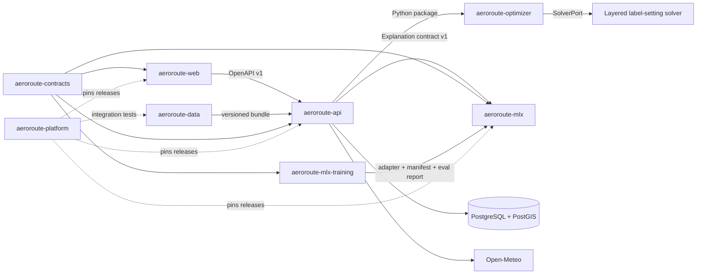

# AeroRoute MLX
## High-Level Design and End-to-End Implementation Guide — Version 6.0

**Document version:** 6.0
**Status:** Active implementation baseline for the educational pre-operational OFP MVP
**Audience:** Software engineers, technical reviewers, and coding agents such as Codex
**Last reviewed:** 28 June 2026
**Primary platform:** Apple Silicon macOS for MLX inference; Linux-compatible backend and CI for all deterministic functionality

---

## 0. Executive architecture review

This document defines a portfolio-grade flight trajectory efficiency simulator. It is intentionally **not** an operational flight-planning system and must never be presented as one.

Version 5.0 retains the controlled multi-repository architecture, deterministic route solver, and offline MLX training/evaluation repository introduced previously, and now closes the base-model decision: Gemma 3 12B text-only in a pinned MLX 4-bit checkpoint is the primary explanation model, with Gemma 3 4B text-only as the lower-memory fallback and challenger models used only for measured bake-offs. The numerical core remains an in-process library rather than an unnecessary network service, while web, API, native MLX inference, model training, data releases, contracts, and platform integration receive independent ownership and release cycles.

The design separates two concerns that must not be mixed:

1. A deterministic engineering core builds a bounded 4D optimization problem and solves it using a versioned solver interface. It calculates candidate trajectories, wind-adjusted time, estimated fuel, emissions, feasibility, and a transparent score.
2. An MLX-hosted local language model explains the deterministic result in natural language. It cannot invent, modify, or recalculate numeric results.
3. An offline QLoRA pipeline may fine-tune an open-weight model to improve structured, aviation-aware explanations, but trained artifacts are promoted only after reproducible evaluation against the untuned baseline.

### 0.1 Gaps identified and closed

| ID | Gap in a typical first draft | Impact | Resolution in this version |
|---|---|---|---|
| G-01 | Product described as a route planner without a safety boundary | Could imply operational or certified use | Reframed as a research and portfolio simulator with explicit non-goals and UI disclaimer |
| G-02 | MLX placed inside the optimization decision loop | Non-deterministic, untestable, and unsafe decisions | MLX is only an explanation adapter; the optimizer is deterministic |
| G-03 | No certifiable global airway/procedure source | The system could overstate incomplete navigation coverage | Version 6 uses cycle-versioned AIRAC.net snapshots for supported routes, preserves a distinct synthetic optimizer corridor, labels every `DCT`/gap, and makes no legal or ATC-compliance claim |
| G-04 | Surface weather used for cruise optimization | Invalid wind estimates at flight level | Pressure-level wind and geopotential-height data are used for cruise; METAR/TAF are informational only |
| G-05 | Fuel estimate lacked mass and flight-phase assumptions | Fuel comparisons could be misleading | Adds representative mass, iterative fuel/mass integration, fixed climb/descent model, and provenance |
| G-06 | MongoDB chosen without a geospatial rationale | Weak fit for spatial constraints, migrations, and relational provenance | PostgreSQL + PostGIS is the primary datastore; JSONB is used where appropriate |
| G-07 | “Generate alternatives” was undefined | No implementable optimization algorithm | Defines a layered 4D corridor graph and time-dependent A*/dynamic programming approach |
| G-08 | Fuel and CO2 both included as independent weights | Double-counts almost the same objective | CO2 is reported; the primary objective uses fuel and time. Future climate effects are separate penalties |
| G-09 | No reproducibility or dataset versioning | Results could not be audited or compared | Every run stores input, algorithm version, dataset snapshots, model, timestamps, and cost breakdown |
| G-10 | MLX assumed to run in Docker and Linux CI | MLX requires Apple Silicon; Docker Desktop Linux containers cannot use Metal | MLX runs natively on macOS behind an adapter; CI uses a deterministic fake/template provider |
| G-11 | No model memory or worker strategy | Multiple API workers could load multiple LLM copies and exhaust unified memory | A single MLX process loads the model once; API and MLX lifecycles are separated |
| G-12 | No external API resilience | Weather or traffic outages would break the application | Adds timeouts, retries, caching, stale-data policy, circuit breaking, and graceful degradation |
| G-13 | No antimeridian or polar-route treatment | Common long-haul routes could render or calculate incorrectly | Adds ellipsoidal geodesics, longitude normalization, geometry splitting, and dedicated property tests |
| G-14 | Testing focused only on endpoint examples | Numerical and geospatial defects would remain undetected | Adds property-based, metamorphic, golden, contract, integration, performance, and MLX evaluation tests |
| G-15 | OpenSky treated as a flight-planning source | Live surveillance data is not a route-planning network and is rate-limited | OpenSky is optional and only used later for historical comparison and validation |
| G-16 | No definition of acceptable accuracy | “Efficient” could not be evaluated | Adds measurable acceptance criteria and validation datasets |
| G-17 | No unit policy | Aviation and SI units could be mixed silently | SI is mandatory internally; aviation units are converted only at boundaries |
| G-18 | No failure-mode UX | Users would not know whether weather or AI was missing | Result includes data-quality flags and explanation provenance; deterministic fallback text is always available |
| G-19 | Monorepo structure coupled unrelated release cycles and platform requirements | Web, deterministic services, data jobs, and the native MLX runtime could not evolve or deploy independently | The solution is split into seven product repositories plus one lightweight contracts repository, with explicit ownership, versioned interfaces, and cross-repository integration tests |
| G-20 | “Optimizer” was described without an explicit solver boundary | Search logic, problem construction, and result validation could become inseparable and difficult to benchmark | Introduces `SolverPort`, a deterministic layered label-setting solver, solver diagnostics, budgets, tie-breaking, and optional future adapters for A*, MathOpt/HiGHS, or CP-SAT |
| G-21 | Fine-tuning was treated as an informal later experiment | Dataset leakage, unmeasured regressions, and unreproducible adapters could undermine the project | Adds `aeroroute-mlx-training`, QLoRA-only initial scope, dataset/model cards, immutable manifests, A/B/C evaluation, and promotion gates |
| G-22 | A specific current model could be selected without compatibility validation | MLX support, caching, memory use, structured generation, or adapter training may regress between releases | Selects Gemma 3 12B text-only only behind a compatibility spike, pins the exact MLX checkpoint and source revision, defines Gemma 3 4B as the lower-memory fallback, and keeps Mistral/Qwen as measured challengers rather than runtime dependencies |

---

# Part I — High-Level Design

## 1. Product overview

### 1.1 Product name

**AeroRoute MLX**

### 1.2 One-line description

A local-first educational pre-operational flight-planning application that combines AIRAC-referenced runways, terminal procedures, airways, deterministic 4D trajectory optimization, weather-aware fuel planning, alternates and diversion context, with a natural-language explanation generated locally using Apple MLX.

### 1.3 Portfolio objective

The project should demonstrate:

- aviation-domain modelling;
- deterministic optimization, solver design, and numerical reasoning;
- constrained graph search with reproducible solver diagnostics;
- FastAPI and clean backend architecture;
- React and geospatial visualization;
- PostgreSQL/PostGIS data modelling;
- resilient integration with public datasets;
- local inference and QLoRA fine-tuning with MLX on Apple Silicon;
- dataset governance, model evaluation, and adapter release management;
- comprehensive automated testing;
- observability, security, documentation, and CI practices expected from a technical lead.

### 1.4 Intended user journey

1. The user selects an origin, destination, departure time, aircraft type, approximate payload/load profile, and optimization profile.
2. The system suggests departure and arrival runways from available airport wind, AIRAC procedure compatibility, and basic aircraft/runway constraints; the user may override either suggestion.
3. It resolves a runway-compatible SID, connected airway/free-route sequence, and runway-compatible STAR. Every unconfirmed connection is labelled `DCT`, degraded, or unavailable rather than presented as AIRAC-confirmed.
4. It computes a great-circle reference and builds weather-aware lateral and cruise-level alternatives around the confirmed navigation corridor.
5. It samples forecast wind at each candidate segment and estimated passage time.
6. A deterministic solver estimates time, trip fuel, CO2, route extension, confidence, and reproducible diagnostics for each candidate.
7. The system selects or validates a destination alternate, identifies suitable en-route diversion candidates, and builds a simplified EASA-style fuel plan.
8. The frontend displays the selected route, alternatives, navlog, fuel plan, provenance, assumptions, and data-quality limitations as a non-operational OFP.
9. An MLX model explains why the selected trajectory wins, strictly using supplied structured facts. It never selects runways, procedures, alternates, fuel quantities, or safety-critical values.

---

## 2. Scope

### 2.1 MVP scope

The MVP supports:

- airport-to-airport planning for catalogue airports with sufficient AIRAC and runway data;
- a limited, explicit list of OpenAP-supported aircraft types;
- flights from 300 NM to 7,500 NM;
- a great-circle baseline;
- suggested and user-editable departure and arrival runways;
- runway-compatible SID and STAR selection;
- an AIRAC-referenced en-route sequence of named fixes, airways, and explicitly labelled `DCT` segments;
- synthetic lateral alternatives inside a configurable corridor, visually distinct from the AIRAC route;
- configurable cruise levels, initially FL300, FL320, FL340, FL360, FL380, and FL400 where supported;
- forecast wind sampled from pressure-level weather data;
- estimated block time, airborne time, cruise fuel, fixed climb/descent fuel, total fuel, and CO2;
- a simplified configurable EASA-style fuel breakdown containing taxi, trip, contingency, destination-alternate, final-reserve, and extra fuel;
- one destination alternate plus informational en-route diversion candidates;
- a traceable non-operational OFP containing the coded route, navlog, levels, time, mass, fuel, alternates, provenance, warnings, and map;
- three profiles: `minimum_fuel`, `minimum_time`, and `balanced`;
- deterministic route explanation fallback;
- optional MLX explanation using a pinned open-weight base model;
- optional post-MVP QLoRA adapter selected only after it beats the prompt-only baseline on release metrics;
- result persistence and history;
- a map, comparison table, cost breakdown, assumptions panel, and data-quality panel.

### 2.2 Explicit non-goals

The MVP does **not**:

- file, transmit, or claim validation of an ICAO flight plan;
- guarantee compliance with free-route airspace, RAD restrictions, ATC clearances, NOTAMs, military areas, country overflight permissions, slots, flow measures, MEL/CDL, or airline policy;
- provide ETOPS/EDTO planning, one-engine-inoperative diversion validation, or equal-time-point calculations;
- calculate certified take-off or landing performance, declared-distance margins, obstacle clearance, or runway condition penalties;
- use airline proprietary performance data;
- claim dispatch-grade fuel accuracy;
- provide safety advice;
- replace a dispatcher, flight-planning provider, pilot, ANSP, or approved operational system;
- use an LLM to calculate route geometry, fuel, or safety decisions.

### 2.3 Mandatory disclaimer

The UI and README must display:

> AeroRoute MLX generates an educational pre-operational flight-plan simulation. Results are approximate, may use incomplete public data, are not an ICAO-fileable flight plan, and are not suitable for operational or safety-critical decisions.

### 2.4 Delivery baseline and progress

Version 6 expands the accepted MVP after the original Version 5 trajectory simulator reached approximately 90% completion. Against the expanded pre-operational OFP scope, the implementation baseline is approximately 62% complete.

The percentages are planning indicators, not release claims:

| Milestone | Expanded-MVP completion |
|---|---:|
| Version 6 baseline | 62% |
| Phase 10 — terminal navigation | 70% |
| Phase 11 — fuel and alternates | 78% |
| Phase 12 — OFP and frontend | 86% |
| Phase 13 — route generalization | 93% |
| Phase 14 — hardening and release | 100% |

---

## 3. Quality attributes and success criteria

### 3.1 Functional acceptance criteria

A release is acceptable when it can:

1. Compute a reproducible baseline route between MAD and JFK.
2. Produce at least three distinct feasible synthetic candidates.
3. Demonstrate that a strong tailwind can make a slightly longer route faster or lower-fuel than the baseline.
4. Show every numeric input contributing to the final score.
5. Re-run a stored optimization using frozen fixtures and reproduce results within documented tolerances.
6. Produce a useful explanation when MLX is disabled.
7. Produce an MLX explanation without allowing any numeric value absent from the deterministic result.
8. Solve identical frozen optimization problems deterministically, including stable tie-breaking and solver diagnostics.
9. Compare base-prompt, few-shot, and QLoRA configurations on the same held-out evaluation set before promoting an adapter.
10. Produce a runway-compatible SID-to-airway-to-STAR route for each supported reference scenario, with every `DCT` or degraded segment explicit.
11. Recalculate procedures deterministically when the user changes a runway and reject incompatible SID/STAR combinations.
12. Produce a mathematically reconcilable fuel plan and include every fuel component in initial-mass treatment.
13. Select or validate a destination alternate and expose the assumptions used to rank en-route diversion candidates.
14. Reproduce an OFP byte-for-byte from frozen AIRAC, airport, aircraft, weather, and configuration snapshots.

### 3.2 Initial SLOs for local development

These are engineering targets, not contractual production SLOs:

| Capability | Target |
|---|---:|
| Airport search P95 | < 150 ms locally |
| Baseline geodesic calculation | < 50 ms |
| Optimization with cached weather, up to 1,500 graph nodes | < 3 s on the target Mac |
| Solver determinism on identical frozen input | Byte-identical canonical result and diagnostics |
| Solver budget compliance | Stops within configured wall-clock/node/label limits and reports termination reason |
| Optimization with live weather | < 12 s, excluding provider outage |
| API error rate in automated integration suite | 0% |
| Deterministic backend line coverage | >= 85% |
| Domain and optimizer branch coverage | >= 90% |
| Frontend line coverage | >= 80% |
| MLX explanation after warm model load | target < 8 s for <= 300 output tokens; benchmark, do not hard-code as a guarantee |

### 3.3 Numerical tolerances

- Geodesic distance tests: within 0.05% of GeographicLib reference output.
- Segment distance sum versus route distance: within 0.2%.
- Wind-vector decomposition: absolute tolerance <= 0.1 kt in unit tests.
- Fuel integration convergence: final two iterations differ by < 1% or a warning is emitted.
- Repeated deterministic runs from identical frozen inputs: exact equality after configured rounding.

---

## 4. Architecture principles

1. **Deterministic core, probabilistic presentation.** The LLM never owns calculations.
2. **Ports and adapters.** Weather, aircraft performance, persistence, and explanations are interfaces.
3. **Local first.** The complete application works on one Apple Silicon Mac.
4. **Graceful degradation.** Missing weather or MLX must not make the core application unusable.
5. **Provenance by default.** Store where every input came from.
6. **UTC and SI internally.** Convert to knots, nautical miles, feet, and flight levels at API/UI boundaries.
7. **Version everything that affects a result.** Algorithm, configuration, datasets, and model identity.
8. **No hidden score.** Every penalty and normalization factor is visible.
9. **Small vertical slices.** Codex implements and proves one feature at a time.
10. **No premature “real route” claims.** Synthetic trajectories are labelled as such.
11. **Repository boundaries follow deployable or reusable capabilities.** A repository must not exist merely to mirror a Python package.
12. **Contracts are versioned independently from implementations.** Breaking interface changes require an explicit major version and coordinated rollout.
13. **Independent CI, coordinated integration.** Every repository proves itself locally; the platform repository proves the released system as a whole.
14. **Problem construction is separate from solving.** The domain builds a versioned optimization problem; interchangeable solver implementations return typed results and diagnostics.
15. **Training is offline and promotion-based.** The inference service never trains models, and no adapter becomes the default without beating a frozen baseline and passing safety/fidelity gates.

---

## 5. System context



### 5.1 Trust boundaries

- Browser input is untrusted.
- Public API responses are untrusted and schema-validated.
- Downloaded model repositories are supply-chain inputs and must be pinned by repository and revision where possible.
- MLX output is untrusted text and must pass validation before display.
- Database content is trusted only after application-level and database constraints.

---

## 6. Container and component view

### 6.1 Repository-to-runtime mapping

The system uses repository boundaries that correspond to independently testable, versioned, and potentially deployable capabilities.

| Repository | Runtime or artifact | Primary responsibility | Must not own |
|---|---|---|---|
| `aeroroute-web` | Browser application and static assets | User experience, map rendering, generated API client, input validation at the UI boundary | Route physics, scoring logic, direct database access |
| `aeroroute-api` | FastAPI service and database migrations | Public API, application orchestration, persistence, auth/rate limiting, weather integration, result history | Numerical optimization implementation, model inference internals |
| `aeroroute-optimizer` | Versioned pure-Python package | Geodesy, optimization-problem construction, solver interfaces and implementations, wind mathematics, flight profile integration, scoring, ranking, diagnostics, result validation | HTTP frameworks, databases, MLX, provider-specific network clients |
| `aeroroute-mlx` | Native macOS HTTP service | Local MLX model lifecycle, base-model/adapter loading, constrained explanations, output validation, deterministic fallback | Flight calculations, database access, public user API, training |
| `aeroroute-mlx-training` | Offline Apple Silicon training and evaluation CLI | Dataset generation/validation, QLoRA training, baseline comparison, model and dataset cards, adapter publication | Serving requests, route calculations, production API orchestration |
| `aeroroute-data` | CLI/batch jobs and versioned manifests | OurAirports ingestion, curated aircraft profiles, fixture generation, dataset checksums and provenance | Serving user traffic, route optimization |
| `aeroroute-platform` | Docker Compose, deployment manifests, observability and integration harness | Local environment, released-version manifest, end-to-end tests, dashboards, operational runbooks | Product business logic |
| `aeroroute-contracts` | Versioned schemas and generated artifacts | JSON Schema/OpenAPI fragments for cross-service payloads, compatibility tests, release notes | Business logic or runtime behavior |

Seven repositories contain executable or release-producing product capabilities. `aeroroute-contracts` remains deliberately small and exists only because the API, web application, MLX service, training pipeline, and integration harness cross language and process boundaries.

### 6.2 Runtime components

#### Web application — `aeroroute-web`

Responsibilities:

- route request form;
- airport and aircraft search;
- interactive route map;
- route comparison and assumptions;
- result history;
- data-quality and disclaimer display;
- consume a generated client pinned to a compatible API contract version.

#### FastAPI application — `aeroroute-api`

Responsibilities:

- validation and public API contracts;
- orchestration of optimization use cases;
- persistence and retrieval;
- weather-provider health and data-quality reporting;
- invocation of the optimizer package;
- invocation of the explanation service;
- OpenAPI publication and backward-compatible endpoint evolution.

#### Optimization package — `aeroroute-optimizer`

Responsibilities:

- geodesic baseline;
- candidate-lattice and typed optimization-problem generation;
- deterministic solver interfaces, label-setting implementation, budgets, diagnostics, and tie-breaking;
- time-dependent segment evaluation;
- flight profile and fuel integration;
- objective normalization and ranking;
- feasibility checks;
- deterministic result generation.

It must not import FastAPI, SQLAlchemy, HTTP clients, MLX, or provider-specific infrastructure. Its public API must be small, typed, and versioned semantically.

#### MLX explanation service — `aeroroute-mlx`

Responsibilities:

- accept only the versioned explanation input contract;
- load one pinned MLX model revision once;
- generate bounded output;
- validate that numeric claims come from supplied facts;
- expose health/readiness endpoints;
- fall back to deterministic explanation when inference is unavailable.

#### Offline MLX training and evaluation — `aeroroute-mlx-training`

Responsibilities:

- generate synthetic explanation examples only from versioned deterministic optimization outputs;
- validate, deduplicate, and split datasets by route/aircraft/weather families rather than random rows;
- run prompt-only, few-shot, and QLoRA experiments under pinned MLX/model revisions;
- evaluate schema validity, winner correctness, numeric fidelity, unsupported claims, required limitations, latency, and memory;
- produce immutable adapter manifests, dataset cards, model cards, and machine-readable evaluation reports;
- publish an adapter only when promotion gates pass.

It must never ingest confidential British Airways or airline-proprietary data. It is not part of the request-serving topology and the inference service never imports its training code.

#### Dataset jobs — `aeroroute-data`

Responsibilities:

- download or load pinned OurAirports CSV files;
- validate required columns;
- curate supported aircraft metadata;
- calculate checksums;
- produce immutable dataset manifests and import bundles;
- publish fixture bundles used by `aeroroute-optimizer` and integration tests.

Database writes are performed through a documented importer interface owned by `aeroroute-api`, or by a migration/import command that reuses the API repository's persistence package. The data repository must not duplicate database schema knowledge.

#### Platform and integration harness — `aeroroute-platform`

Responsibilities:

- clone or reference compatible repository releases;
- start PostgreSQL/PostGIS and product services;
- define local DNS, ports, secrets, and health dependencies;
- run cross-repository contract, integration, E2E, and smoke tests;
- maintain a version manifest for reproducible demos;
- hold dashboards, alerts, runbooks, and deployment examples.

### 6.3 Dependency and call direction



Allowed compile-time dependencies:

- `aeroroute-api` depends on a released `aeroroute-optimizer` package and generated/validated contract artifacts.
- `aeroroute-web` depends on a generated TypeScript client produced from the public API specification.
- `aeroroute-mlx` depends only on the explanation contract and released model artifacts, not on the optimizer implementation or training source.
- `aeroroute-mlx-training` may consume frozen explanation contracts and deterministic result fixtures, but it may not become a runtime dependency of API, optimizer, or web.
- `aeroroute-platform` may depend on release artifacts from all repositories but no product repository may depend on `aeroroute-platform`.
- `aeroroute-data` may consume domain-neutral schemas and publish bundles, but it must not import API application services.

Circular repository dependencies are forbidden.

### 6.4 Ownership rule

Each issue and pull request names exactly one owning repository. A feature spanning repositories is represented by a tracking issue in `aeroroute-platform` with linked implementation issues in the affected repositories. Cross-repository changes are merged in a backward-compatible order described in Section 21.7.

## 7. Deployment topology

### 7.1 Recommended local topology

The `aeroroute-platform` repository is the entry point for running the complete system locally.

```text
macOS host (Apple Silicon)
├── aeroroute-web checkout or released image         :5173
├── aeroroute-api checkout or released image         :8000
├── aeroroute-mlx native checkout/process            :8081
└── Docker Desktop, orchestrated by aeroroute-platform
    ├── PostgreSQL + PostGIS                          :5432
    ├── optional API container                        :8000
    ├── optional web container                        :5173/8080
    └── observability services                        :various
```

Do not place the MLX process inside a normal Docker Desktop Linux container. It will not have native Metal acceleration. The platform Compose file therefore treats the MLX endpoint as an external native dependency in the default Apple Silicon profile and provides a deterministic fake service in the Linux profile.

### 7.2 Repository release artifacts

| Repository | Release artifact |
|---|---|
| `aeroroute-web` | OCI image and static build archive |
| `aeroroute-api` | OCI image, OpenAPI document, migration image/command |
| `aeroroute-optimizer` | Python wheel and source distribution |
| `aeroroute-mlx` | Python wheel/lock file plus native launch package; no Linux runtime promise |
| `aeroroute-mlx-training` | Adapter artifact, adapter manifest, dataset/model cards, evaluation report and checksums; base weights are referenced, not republished |
| `aeroroute-data` | Dataset manifest, checksums, fixture bundle, optional job image |
| `aeroroute-contracts` | Tagged schema bundle and generated-language package artifacts |
| `aeroroute-platform` | Version manifest, Compose/deployment release, integration report |

### 7.3 CI topology

Each repository has independent CI. The platform repository adds released-system validation.

```text
Repository CI
├── web: lint, typecheck, unit, component, build
├── api: lint, typecheck, unit, PostGIS integration, OpenAPI compatibility
├── optimizer: unit, property, metamorphic, solver-oracle, golden, benchmark
├── mlx: contract/fake tests on Linux; native MLX suite on Apple Silicon
├── mlx-training: dataset validation on Linux; QLoRA/evaluation on Apple Silicon
├── data: schema, checksum, importer contract, fixture determinism
├── contracts: schema lint, breaking-change detection, code generation
└── platform: manifest validation and infrastructure lint

Cross-repository CI in aeroroute-platform
├── resolve pinned release manifest
├── start PostGIS, API, web, deterministic explanation service
├── seed pinned dataset bundle
├── run consumer/provider contract tests
├── run Playwright journeys
├── run migration compatibility tests
└── publish an integration report
```

### 7.4 Process model

- Run one API process during early local development.
- The API imports one released optimizer package version.
- Load MLX once in a dedicated native process.
- Run QLoRA training only as an offline CLI/job outside the serving process.
- Never start multiple MLX workers that each load the same model.
- Bound concurrent optimization requests with an application semaphore.
- Execute CPU-heavy optimization outside the event loop using a thread or process executor.
- Add a durable background queue only after profiling proves synchronous execution insufficient.

### 7.5 Deployment profiles

`aeroroute-platform` defines three profiles:

1. `core-linux`: web, API, PostGIS, frozen datasets, deterministic explanation provider. This is the default CI and portable demo profile.
2. `local-mlx`: the core profile plus a native `aeroroute-mlx` process on Apple Silicon.
3. `observability`: adds metrics, logs, traces, and dashboards for performance demonstrations.

The product must remain fully usable under `core-linux`; MLX enhances explanations but is not required for route computation.

## 8. Technology choices

| Area | Choice | Rationale |
|---|---|---|
| Backend | Python 3.12, FastAPI, Pydantic v2 | Strong typed API and aligned with MLX/OpenAP ecosystem |
| Dependency management | `uv` with lock file | Fast, reproducible Python environments |
| Domain math | NumPy, GeographicLib | Numerical operations and ellipsoidal geodesics |
| Default route solver | Custom layered label-setting/dynamic programming | Natural fit for the bounded acyclic 4D lattice, explicit dominance rules, deterministic behavior, and transparent diagnostics |
| Solver research adapters | A* initially; optional OR-Tools MathOpt/CP-SAT or HiGHS later | Benchmark richer discrete/linear constraints without coupling the MVP to an ill-fitting external formulation |
| Aircraft model | OpenAP | Open aircraft performance, fuel, and emissions model |
| Database | PostgreSQL + PostGIS | Spatial types, relational integrity, migrations, JSONB, reproducible queries |
| ORM/migrations | SQLAlchemy 2 async + GeoAlchemy2 + Alembic | Mature typed persistence and schema evolution |
| HTTP | HTTPX + Tenacity | Async I/O, timeouts, retry policy |
| ML inference | MLX + `mlx-lm` | Native local inference on Apple Silicon |
| ML adaptation | MLX LM QLoRA/LoRA | Parameter-efficient local adaptation with separately versioned adapters |
| Primary base model | `mlx-community/gemma-3-text-12b-it-4bit`, gated by a compatibility spike; `mlx-community/gemma-3-text-4b-it-4bit` lower-memory fallback | Strong text instruction model with an established MLX conversion; exact checkpoint, source revision, Gemma terms, tokenizer, chat template, and runtime versions are pinned |
| Frontend | React, TypeScript, Vite | Fast modern UI and strong typing |
| Server state | TanStack Query | Cache, loading/error states, retries |
| Map | MapLibre GL JS | GeoJSON visualization and interactive layers |
| Unit testing | pytest, Hypothesis, Vitest | Example and property-based tests |
| API mocking | RESPX | Deterministic HTTPX tests |
| Integration | Testcontainers or CI PostGIS service | Real database behavior |
| E2E | Playwright | Browser-level acceptance tests |
| Observability | structlog, OpenTelemetry, Prometheus | Structured logs, traces, and metrics |
| Cross-repo contracts | OpenAPI 3.1, JSON Schema, generated clients | Language-neutral, versioned interfaces and compatibility checks |
| Release management | Semantic Versioning, immutable tags, platform version manifest | Independent releases with reproducible integration |
| Automation | GitHub Actions, Renovate/Dependabot | Per-repository quality gates and automated dependency update PRs |

### 8.1 ADR: PostgreSQL/PostGIS instead of MongoDB

The core entities have strong relationships and require spatial indexes, migrations, uniqueness constraints, and data provenance. PostgreSQL/PostGIS is therefore the primary database.

MongoDB may be evaluated later for raw, high-volume observation documents, but adding it to the MVP would create a second datastore without a compelling requirement.

### 8.2 ADR: custom corridor optimizer before OpenAP-TOP

OpenAP-TOP is a relevant trajectory optimization reference and future adapter, but the MVP implements a transparent layered graph optimizer because:

- it is easier to explain in a portfolio;
- it permits exhaustive unit and property testing;
- it produces explicit alternatives;
- it avoids hiding the main learning objective behind a library;
- it keeps the optimization problem bounded.

A later milestone can compare the custom optimizer with OpenAP-TOP.

---

### 8.3 ADR: an explicit solver layer, but not a separate solver service

The project needs a solver, but the solver is a library capability inside `aeroroute-optimizer`, not another network service or repository.

The MVP uses a custom layered label-setting/dynamic-programming solver because:

- the candidate graph progresses monotonically through route layers and is acyclic;
- edge costs depend on propagated passage time and changing aircraft mass;
- dominance pruning and bounded labels are easier to inspect than a black-box formulation;
- deterministic tie-breaking and detailed diagnostics are portfolio features;
- small exhaustive graphs can act as a correctness oracle.

The solver boundary is nevertheless explicit so later research can compare:

- A* with an admissible optimistic-wind heuristic;
- OR-Tools MathOpt/CP-SAT for additional discrete operational-style constraints;
- HiGHS for linear or mixed-integer approximations;
- OpenAP-TOP as an external trajectory-optimization reference.

An external solver is adopted only when a documented formulation, benchmark, and acceptance test show a clear advantage.

### 8.4 ADR: Gemma 3 text-only with QLoRA instead of full model retraining

Full pretraining or full-parameter fine-tuning is out of scope. The explanation task is narrow: reproduce validated facts, use aviation terminology, compare alternatives, and state limitations. QLoRA/LoRA provides enough adaptation while keeping base weights immutable and separately licensed.

Training begins only after the prompt-only baseline and evaluation harness exist. The primary candidate is Gemma 3 12B instruction-tuned, using the text-only MLX 4-bit checkpoint `mlx-community/gemma-3-text-12b-it-4bit`, subject to a compatibility spike covering load, chat-template behavior, structured output, cache behavior, memory, LoRA training, adapter save/reload, and deterministic fallback. Gemma 3 4B text-only remains the lower-memory fallback if the 12B candidate fails hardware or release gates. Mistral 7B Instruct v0.3 and Qwen3.5-9B may be retained as bake-off challengers, but are not production dependencies.

## 9. Domain model

### 9.1 Core value objects

```python
@dataclass(frozen=True)
class GeoPoint:
    latitude_deg: float
    longitude_deg: float

@dataclass(frozen=True)
class FlightLevel:
    value: int  # e.g. 350 means FL350

@dataclass(frozen=True)
class UtcInstant:
    value: datetime  # timezone-aware and UTC

@dataclass(frozen=True)
class WindVector:
    east_mps: float
    north_mps: float

@dataclass(frozen=True)
class RouteState:
    point: GeoPoint
    timestamp: datetime
    altitude_m: float
    mass_kg: float
```

Use value objects or validated Pydantic/domain types to prevent silent unit mixing.

### 9.2 Aggregate entities

#### Airport

- `id`
- `ident`
- `iata_code`
- `icao_code`
- `name`
- `type`
- `position geography(Point, 4326)`
- `elevation_ft`
- `country_code`
- `municipality`
- `source_snapshot_id`
- `is_active`

#### AircraftProfile

- `icao_type`
- `display_name`
- `engine_variant`
- `supported_cruise_levels`
- `representative_empty_mass_kg`
- `representative_max_takeoff_mass_kg`
- `default_load_factor`
- `performance_provider`
- `performance_model_version`

#### OptimizationRun

- `id` UUID
- normalized request JSONB
- request hash
- status
- algorithm version
- configuration version
- weather snapshot metadata
- airport dataset snapshot
- aircraft model metadata
- created/started/completed timestamps
- degraded-mode flags
- failure code and safe message

#### CandidateTrajectory

- `id`
- `optimization_run_id`
- `rank`
- `profile`
- `geometry geography(LineString, 4326)`
- 4D points JSONB or normalized child rows
- distance, route extension, time, fuel, CO2
- objective components and final score
- feasibility flags
- assumptions

#### Explanation

- `candidate_trajectory_id`
- provider: `mlx` or `template`
- model repository and revision
- prompt version
- validated text
- latency and token counts where available
- created timestamp

#### DatasetSnapshot

- source name
- source URL
- retrieved timestamp
- source modified timestamp if supplied
- SHA-256 checksum
- row count
- importer version
- license/terms note

#### Runway

- airport ICAO and runway designator;
- threshold position, elevation, magnetic/true bearing, length, width, and surface when available;
- operational-status and declared-distance fields when supplied by the source;
- supported aircraft constraints used by the simplified recommendation rule;
- AIRAC/source snapshot, cycle, retrieval time, and data-quality flags.

#### Procedure

- airport ICAO, type `SID` or `STAR`, identifier, transition, and runway applicability;
- ordered named fixes and legs, preserving provider sequence and leg metadata;
- graph entry/exit fix and connectivity status;
- AIRAC cycle, source snapshot, and degraded-data flags.

#### Airway

- identifier and ordered AIRAC fixes;
- directionality and level constraints when supplied;
- source cycle and provenance;
- connectivity diagnostics and explicit gaps.

#### FuelPlan

- policy identifier and configuration version;
- taxi, trip, contingency, alternate, final-reserve, extra, block, and take-off fuel;
- calculation basis and rounding for every component;
- destination-alternate route reference;
- initial, take-off, landing, and alternate-arrival mass estimates;
- validation warnings and `operationally_approved: false` invariant.

#### DestinationAlternate

- airport and ranking status: `suggested`, `user_selected`, or `rejected`;
- route, distance, time, fuel, runway compatibility, weather availability, and data-quality rationale;
- suitability checks performed and checks explicitly not performed.

#### EnrouteDiversion

- airport, nearest route point, along-track position, diversion distance, and estimated diversion time;
- runway compatibility, airport status, weather availability, and ranking rationale;
- informational-only flag; no ETOPS/EDTO suitability claim.

#### FlightPlan

- immutable request and selected optimization-run reference;
- origin/destination runway selections and recommendation provenance;
- SID, connected en-route sequence, STAR, and destination alternate;
- selected 4D trajectory, coded route, navlog, fuel plan, diversion candidates, warnings, and disclaimer;
- AIRAC, airport, weather, aircraft, optimizer, and configuration snapshots;
- status `complete`, `degraded`, or `failed`, where `degraded` enumerates every missing or unconfirmed element.

---

## 10. Data sources and provenance

### 10.1 Airports, runways, and navigation data

Use OurAirports for the MVP airport catalogue.

Use AIRAC.net through an isolated provider adapter for the initial runway, procedure, fix, and airway graph. AIRAC.net data must be cached as immutable, cycle-versioned snapshots before it contributes to a persisted flight plan. The adapter is replaceable; no domain or API type may encode provider-specific response shapes.

Requirements:

- import from a local checked fixture in tests;
- allow a production-like import command to download current CSV data;
- calculate SHA-256 before import;
- retain snapshot metadata;
- reject rows without valid coordinates;
- never assume IATA uniqueness where the source does not guarantee it;
- prefer ICAO/ident as the primary search/display identifier;
- include attribution in the README even though the data is public domain.
- preserve real aviation identifiers and provider ordering;
- retain runway/procedure applicability and AIRAC cycle;
- never synthesize a plausible-looking fix, airway, SID, or STAR identifier;
- label a connection `DCT` only when it is intentionally direct and distinguish it from a provider or graph failure;
- return a degraded or failed plan when terminal procedures cannot connect to the en-route graph.

### 10.2 Cruise weather

Use Open-Meteo pressure-level variables for the initial provider adapter.

Required variables for selected levels:

- wind speed;
- wind direction;
- geopotential height;
- optionally temperature for later true-airspeed and contrail models.

Important implementation rules:

- use `timezone=GMT` or Unix timestamps;
- request multiple coordinates in batches;
- use `cell_selection=nearest` or document the selected policy for ocean points;
- map flight altitude to surrounding pressure levels using geopotential heights rather than fixed nominal altitude alone;
- interpolate wind as vector components, not directly as compass degrees;
- interpolate in time between forecast hours;
- store provider model name, forecast generation/reference information when available, and fetch time;
- cache by rounded location, pressure levels, forecast hour, and provider model;
- mark stale or missing data explicitly.

### 10.3 Airport and hazardous weather

The Aviation Weather Center API may later provide:

- METAR and TAF for airport context;
- SIGMET geometry for an optional hazard penalty;
- PIREP/AIREP for visualization or validation.

Do not use METAR wind as a substitute for cruise-level wind.

### 10.4 OpenSky

OpenSky is optional and not part of MVP route generation.

Potential later uses:

- compare simulated distance with observed tracks;
- validate typical cruise levels and route dispersion;
- build a historical benchmark set;
- show how actual operations differ from the unconstrained synthetic optimum.

The adapter must respect authentication, credits, rate limits, caching, and attribution.

### 10.5 Aircraft performance

OpenAP supplies public aircraft performance and fuel/emissions models.

Rules:

- maintain a curated allow-list of verified types;
- record the OpenAP package version and selected engine/model;
- validate all requested flight levels and speeds against configured bounds;
- present estimates as approximate;
- isolate OpenAP behind `AircraftPerformancePort` so another model can be substituted.

### 10.6 Destination and en-route airport weather

Open-Meteo remains sufficient for route-level wind visualization, but runway suggestions and alternate ranking require timestamped airport wind and basic destination/alternate weather availability. Prefer an Aviation Weather Center METAR/TAF adapter where coverage exists, with recorded fixtures and a clearly labelled Open-Meteo fallback.

Weather is one input to a suggestion, not proof that a runway is active or an alternate is legally suitable. Missing TAF, minima, NOTAM, runway condition, or operator constraints must appear in the OFP limitations.

---

## 11. Optimization design

### 11.1 Terminology

- **Baseline trajectory:** sampled WGS84 ellipsoidal geodesic between origin and destination.
- **Candidate corridor:** region around the baseline where synthetic alternatives are generated.
- **Layer:** progress step along the route.
- **Lateral offset:** signed cross-track displacement from the baseline.
- **Vertical state:** candidate cruise flight level at a layer.
- **4D state:** latitude, longitude, altitude, and estimated passage time.

### 11.2 Baseline route

Use GeographicLib WGS84 inverse and line methods.

Algorithm:

1. Validate origin and destination are distinct.
2. Calculate ellipsoidal distance and initial azimuth.
3. Select a segment length, initially 100 km, bounded so there are 20–100 layers.
4. Sample points at equal geodesic distance.
5. Normalize longitude to `[-180, 180)` for storage.
6. Preserve an unwrapped longitude sequence for calculations and map continuity.

### 11.3 Candidate lattice

For each progress layer:

- compute the local baseline bearing;
- generate cross-track offsets such as `[-400, -300, ..., 0, ..., +400] km` for long-haul, scaled down for shorter routes;
- generate valid flight-level states;
- include the baseline state at every layer;
- connect nodes only to plausible neighboring offsets and levels.

Initial constraints:

- maximum lateral change per layer;
- maximum turn angle;
- maximum one-step vertical change;
- minimum time between step climbs;
- no candidate farther than configured corridor width;
- reject coordinates outside valid latitude range;
- cap graph node and edge counts.

The graph is layered and acyclic in forward progress. This permits dynamic programming. Time dependence means edge cost depends on arrival time at the source state; therefore the state includes a discretized time bucket or the algorithm propagates the best label by time.

### 11.4 Segment physics

For each edge:

1. Calculate ellipsoidal segment distance and true track.
2. Obtain interpolated wind vector at midpoint, estimated midpoint time, and flight altitude.
3. Compute tailwind component using vector projection.
4. Estimate true airspeed from aircraft/cruise configuration.
5. Compute ground speed with lower/upper safety bounds.
6. Compute segment duration.
7. Query the performance adapter for fuel flow at representative mass, altitude, and speed.
8. Integrate fuel over duration.
9. Update mass for the next state.
10. Add penalties for excessive turns, level changes, missing weather, and optional hazards.

Do not add scalar wind direction directly to track. Convert meteorological “from” direction and speed into east/north vector components first.

### 11.5 Mass and fuel iteration

Fuel depends on mass, while initial mass depends partly on required fuel.

Use a bounded fixed-point process:

1. Estimate payload from aircraft defaults and selected load profile.
2. Estimate initial trip fuel using still-air distance plus fixed reserves used only as a mass assumption.
3. Calculate candidate fuel while reducing mass segment by segment.
4. Recalculate initial mass using the new trip-fuel estimate.
5. Repeat up to three times or until fuel changes by less than 1%.
6. Emit `fuel_not_converged` if the threshold is not reached.

The UI must distinguish:

- modeled trip fuel;
- fixed climb/descent allowance;
- optional mass-assumption fuel;
- Version 5 fixed reserves, retained only for backward-compatible `/optimizations` responses.

For `/flight-plans`, mass convergence uses the complete `FuelPlan`; contingency, alternate, final reserve, and extra fuel contribute to initial and take-off mass even though they are not burned along the planned destination trajectory. The selected alternate route is evaluated with the estimated destination go-around/diversion mass, and the calculation iterates until both trip fuel and alternate fuel satisfy the documented tolerance.

### 11.5.1 Simplified EASA-style fuel policy

The default policy is deliberately simplified and configurable. It is a transparent planning model, not a regulatory-compliance implementation:

1. `taxi_fuel_kg`: aircraft-profile default, overridable within server bounds.
2. `trip_fuel_kg`: modeled fuel from take-off through approach and landing at destination.
3. `contingency_fuel_kg`: 5% of trip fuel by default.
4. `alternate_fuel_kg`: missed-approach allowance plus modeled destination-to-alternate route fuel.
5. `final_reserve_fuel_kg`: 30 minutes at the aircraft profile's holding-flow assumption for turbine aircraft.
6. `extra_fuel_kg`: zero by default and explicitly supplied by the user when non-zero.
7. `block_fuel_kg`: sum of all components.
8. `takeoff_fuel_kg`: block fuel minus taxi fuel.

Every component returns its formula, source/configuration version, unrounded value, displayed value, and warnings. The server rejects negative values, impossible mass states, missing alternate fuel when an alternate is required, and block fuel above the configured representative aircraft limit.

### 11.6 Flight phases

MVP simplification:

- terminal, climb, and descent path geometry are not optimized;
- use an aircraft-specific or generic fixed climb/descent distance, time, and fuel estimate;
- optimize the en-route/cruise portion;
- add phase estimates consistently to all candidates;
- state this assumption visibly.

A later version can integrate OpenAP climb and descent kinematics.

### 11.7 Objective function

Do not combine raw values with incompatible scales.

For a candidate set, normalize each component against the baseline or the range of feasible candidates.

```text
fuel_delta = (candidate_fuel - baseline_fuel) / baseline_fuel
time_delta = (candidate_time - baseline_time) / baseline_time
extension   = max(0, candidate_distance - geodesic_distance) / geodesic_distance

score =
    w_fuel      * fuel_delta
  + w_time      * time_delta
  + w_extension * extension
  + hazard_penalty
  + maneuver_penalty
  + data_quality_penalty
```

Default profiles:

| Profile | Fuel | Time | Extension | Notes |
|---|---:|---:|---:|---|
| minimum_fuel | 0.80 | 0.15 | 0.05 | CO2 reported, not double-weighted |
| minimum_time | 0.15 | 0.80 | 0.05 | May accept higher fuel |
| balanced | 0.55 | 0.40 | 0.05 | Default portfolio scenario |

CO2 is derived from fuel and displayed separately. It must not be an additional independent weight unless a future objective includes non-CO2 climate effects.

### 11.8 Solver architecture

The domain constructs an immutable `OptimizationProblem`; a solver explores it and returns a typed `SolverResult`. Problem construction, solving, ranking, and validation remain separate stages.

```python
class SolverPort(Protocol):
    def solve(
        self,
        problem: OptimizationProblem,
        settings: SolverSettings,
    ) -> SolverResult:
        ...

@dataclass(frozen=True)
class SolverSettings:
    max_wall_time_s: float
    max_expanded_labels: int
    max_labels_per_state: int
    deterministic_seed: int
    relative_gap_target: float | None = None

@dataclass(frozen=True)
class SolverDiagnostics:
    implementation: str
    version: str
    termination_reason: str
    optimality_status: str
    expanded_labels: int
    pruned_dominated_labels: int
    generated_transitions: int
    elapsed_ms: int
    best_lower_bound: float | None
    relative_gap: float | None
```

Required implementations:

1. `ExhaustiveSmallGraphSolver`, test-only, acts as an oracle on tiny lattices.
2. `LayeredLabelSettingSolver`, the production MVP implementation.
3. `AStarSolver`, optional benchmark after the MVP solver is correct.

Required behavior:

- stable ordering and deterministic tie-breaking by score, fuel, time, path signature, then state identifier;
- explicit `optimal`, `feasible_budget_limited`, or `infeasible` status;
- no silent partial result when a budget is exhausted;
- immutable problem and result objects;
- canonical serialization for reproducibility;
- metrics for labels expanded, dominance pruning, branching, elapsed time, and termination reason;
- infeasibility diagnostics that identify the first materially constraining rule when possible.

The solver chooses among candidates; it does not fetch weather, call OpenAP directly, persist data, or generate prose.

### 11.9 Search strategy

MVP recommendation:

- layered dynamic programming for each profile;
- keep the best `k` labels per node when arrival time materially changes future winds;
- use a dominance rule: a label is dominated when another reaches the same node no later, with no more fuel and no higher score;
- cap `k`, initially 3–5;
- retain predecessor links to reconstruct paths.

Alternative implementation:

- A* over `(layer, offset, flight_level, time_bucket)`;
- admissible heuristic based on remaining still-air distance and optimistic tailwind.

Implement dynamic programming first because the graph is layered and easier to test.

### 11.10 Alternative diversity

Returning the three lowest scores may produce visually identical routes.

Select alternatives using:

- Fréchet or Hausdorff distance between route geometries;
- different dominant lateral side;
- different cruise-level strategy;
- minimum score tolerance.

Return:

- winner for requested profile;
- nearest meaningful alternative;
- profile contrast, such as fastest versus lowest fuel.

### 11.11 Feasibility and result validation

Before persistence, verify:

- finite numeric values;
- positive time, distance, and fuel;
- monotonically increasing timestamps;
- non-increasing mass;
- route starts/ends at expected boundary points;
- no longitude jump remains unsplit for UI geometry;
- graph constraints respected;
- score equals stored component formula after rounding;
- chosen candidate belongs to evaluated candidate set.

### 11.12 Pre-operational route assembly

Route assembly occurs before trajectory scoring:

1. Rank compatible runways from available wind, runway geometry, AIRAC procedure availability, and basic aircraft/runway constraints.
2. Use the requested runway when supplied; otherwise use the highest-ranked suggestion and record the rationale.
3. Find runway-compatible SIDs whose final fix connects to the bounded en-route AIRAC graph.
4. Find runway-compatible STARs whose initial fix is reachable from that graph.
5. Search the graph between terminal connection fixes, preserving airway names and directionality when available.
6. Emit explicit `DCT` legs only under configured maximum-distance and provenance rules.
7. Mark the plan degraded when required metadata is absent; fail when no connected route can be built without inventing navigation data.

The deterministic trajectory optimizer may compare geometric/weather variants around this navigation route, but the UI must never visually conflate a synthetic optimizer line with the AIRAC-confirmed route.

### 11.13 Alternate and diversion selection

The destination alternate is user-selectable. When omitted, the server ranks catalogue airports using route distance, compatible runway length/surface, airport status, available procedure/navigation data, and weather-data availability. The response includes rejected candidates and machine-readable reasons.

En-route diversion candidates are sampled along the selected route and ranked by diversion distance/time plus the same basic airport/runway checks. They are informational only. ETOPS/EDTO, one-engine-inoperative performance, rescue/fire category, customs, handling, curfew, NOTAM, minima, and operator approval remain unverified and are listed as limitations.

---

## 12. Geospatial edge cases

### 12.1 Antimeridian

Maintain two representations:

- unwrapped longitudes for path calculations;
- normalized/split GeoJSON for storage and map display.

A route from Tokyo to North America must not draw across the entire map in the wrong direction.

### 12.2 Polar regions

- rely on ellipsoidal geodesics, not Web Mercator distance;
- do not use screen coordinates for calculations;
- MapLibre visualization may distort high latitudes, so show numeric distance separately;
- clamp synthetic offsets before singular behavior near the pole;
- add dedicated tests above 70° latitude.

### 12.3 Coordinate order

- internal `GeoPoint`: latitude, longitude;
- GeoJSON and PostGIS constructor order: longitude, latitude;
- centralize conversion helpers and test them.

---

## 13. MLX design

### 13.1 Role of MLX

MLX provides a local natural-language explanation of a completed deterministic result.

It must never:

- select a route;
- calculate fuel or time;
- infer missing weather;
- alter numeric values;
- state that the route is legal, safe, dispatchable, or ATC-compliant.

### 13.2 Explanation input contract

Supply a compact JSON object such as:

```json
{
  "route": {"origin": "MAD", "destination": "JFK"},
  "aircraft": "A359",
  "profile": "balanced",
  "winner": {
    "distance_nm": 3168.2,
    "time_min": 431.4,
    "fuel_kg": 42190,
    "co2_kg": 132854,
    "average_tailwind_kt": 27.3,
    "route_extension_pct": 1.8
  },
  "baseline": {
    "distance_nm": 3112.1,
    "time_min": 442.7,
    "fuel_kg": 43580
  },
  "deltas": {
    "time_pct": -2.55,
    "fuel_pct": -3.19
  },
  "assumptions": [
    "synthetic en-route trajectory",
    "public forecast wind",
    "representative aircraft mass"
  ],
  "data_quality": ["no operational airspace constraints"]
}
```

The values are rendered from validated domain objects, never from raw browser text.

### 13.3 Output contract

Prefer structured generation followed by deterministic rendering:

```json
{
  "summary": "...",
  "reasons": ["...", "..."],
  "trade_off": "...",
  "limitations": ["..."]
}
```

Validate:

- maximum lengths;
- required disclaimer language;
- no unsupported numbers;
- no banned operational claims;
- no markdown/script injection;
- no empty fields.

If validation fails, use the template provider.

### 13.4 Provider interface

```python
class ExplanationPort(Protocol):
    async def explain(self, facts: ExplanationFacts) -> ExplanationResult:
        ...
```

Implementations:

- `TemplateExplanationProvider` — deterministic and used in CI;
- `MlxExplanationProvider` — Apple Silicon only;
- optional future remote provider, disabled by default.

### 13.5 Model selection and compatibility spike

The selected primary candidate is **Gemma 3 12B instruction-tuned, text-only**, using the pinned MLX checkpoint `mlx-community/gemma-3-text-12b-it-4bit` and recording the upstream source model `google/gemma-3-12b-it`. The model is open-weight under the Gemma terms rather than Apache-2.0; acceptance and redistribution obligations must be recorded before automated download or artifact publication. The lower-memory fallback is `mlx-community/gemma-3-text-4b-it-4bit`. Mistral 7B Instruct v0.3 and Qwen3.5-9B are optional challengers for the model bake-off, not fallback runtime dependencies.

Before adopting a base model, `aeroroute-mlx-training` runs a compatibility spike that proves:

- the exact MLX checkpoint, source model, tokenizer, chat template, and immutable revisions load under pinned `mlx` and `mlx-lm` versions;
- the text-only `gemma3_text` architecture is used; vision inputs and `mlx-vlm` are outside this project;
- quantized inference fits the target Mac with measured headroom at the application-enforced context limit;
- JSON/structured output meets the baseline pass rate under deterministic and low-temperature decoding;
- stop tokens, end-of-turn behavior, and multi-request lifecycle are correct;
- prompt caching is disabled by default and enabled only after Gemma-specific correctness and latency benchmarks pass;
- QLoRA can complete a small smoke training run, save the adapter, reload it, and reproduce the evaluation result;
- an optional fused checkpoint round trip is tested before any fused artifact is published;
- serving handles timeout and memory-pressure failure paths;
- the Gemma terms, model-card obligations, source lineage, and redistribution constraints are recorded.

The initial model portfolio is:

| Role | Model | Purpose | Promotion rule |
|---|---|---|---|
| Primary | `mlx-community/gemma-3-text-12b-it-4bit` | Prompt-only baseline, serving, and QLoRA candidate | Must pass all compatibility and fidelity gates on target hardware |
| Lower-memory fallback | `mlx-community/gemma-3-text-4b-it-4bit` | Development on smaller Macs and graceful model downgrade | Must preserve contract and numeric-fidelity gates |
| Control baseline | Mistral 7B Instruct v0.3 MLX 4-bit | Stable cross-family benchmark | Never promoted merely because it is faster |
| Experimental challenger | Qwen3.5-9B MLX 4-bit | Quality comparison and portability evidence | Optional; no runtime dependency |
| Deferred | Gemma 4 family | Future re-evaluation after MLX serving/training and checkpoint round-trip maturity | Requires a new ADR and full compatibility spike |

The application caps prompt context at 4,096 tokens and output at 300 tokens for the MVP. AeroRoute explanations do not need long context, so no architecture claim about larger context is relied upon.

Selection criteria:

- fits comfortably in the Mac’s unified memory;
- follows JSON and instruction constraints reliably;
- acceptable English and Spanish explanation quality;
- clearly documented model terms compatible with the intended public portfolio use;
- no need for `trust_remote_code` unless explicitly reviewed;
- repository, revision, quantization, tokenizer, chat template, MLX versions, and conversion provenance recorded.

Do not hard-code the model name into domain or API code. Resolve it through a signed model manifest.

### 13.6 Model lifecycle

- load once at service startup;
- expose readiness only after load succeeds;
- serialize or tightly bound concurrent generations;
- cap context and output tokens;
- use prompt caching only after measuring benefit;
- record latency and memory-related failures;
- return a safe fallback when the model is unavailable or out of memory.

### 13.7 Fine-tuning strategy

Fine-tuning is a post-baseline milestone, not a prerequisite for the deterministic MVP. Use **QLoRA/LoRA**, not full model retraining.

The model is trained only to:

- produce the versioned explanation JSON schema;
- identify the supplied winning route and objective profile;
- reproduce numeric facts without mutation;
- describe signed deltas and trade-offs correctly;
- use concise aviation-aware terminology;
- include supplied assumptions, data-quality warnings, and non-operational limitations.

It is never trained to calculate geometry, fuel, weather, feasibility, ranking, or operational legality.

### 13.7.1 Gemma-specific training constraints

- Use the instruction-tuned text-only checkpoint, not the multimodal runtime path.
- Preserve the checkpoint tokenizer and chat template; do not hand-roll role tokens.
- Mask prompt tokens for supervised explanation training unless an experiment explicitly proves otherwise.
- Start with LoRA on a limited number of upper layers and increase only after memory and quality measurements.
- Keep `max_seq_length` at 2,048 initially; the application contract is intentionally small.
- Run a 50–100 step smoke experiment before every full training configuration.
- Record peak unified memory, training tokens per second, validation loss, and adapter size.
- Do not fuse adapters by default. Serve base plus adapter so rollback and A/B testing remain cheap.
- If a fused checkpoint is produced for demonstration, validate load, generation, checksum, and unfused-versus-fused output equivalence on the gold set.

### 13.8 Dataset design

Initial target:

- 3,000–5,000 training examples;
- approximately 500 validation examples;
- 500–1,000 held-out test examples;
- at least 200 manually reviewed gold examples.

Examples are generated from frozen deterministic runs covering short-, medium-, and long-haul routes; multiple aircraft; still-air and wind scenarios; all optimization profiles; close decisions; degraded weather; infeasible cases; dateline and high-latitude routes.

Split by grouped route/aircraft/weather families. Random row splits are forbidden because near-duplicate synthetic scenarios would leak into evaluation.

Every record stores:

- optimizer and solver versions;
- source run/fixture identifier;
- contract version;
- prompt/template version;
- provenance and generation script version;
- review state and reviewer notes where applicable.

No confidential, personal, proprietary airline, or copied copyrighted operational manual content is permitted.

### 13.9 Evaluation and promotion

Compare on exactly the same held-out corpus:

A. base model plus strict prompt;
B. base model plus strict prompt and approved few-shot examples;
C. base model plus QLoRA adapter.

Mandatory release gates:

| Metric | Initial gate |
|---|---:|
| Valid explanation JSON | >= 99.5% |
| Winner and profile correctness | 100% |
| Numeric fidelity | 100% after validator; raw generation rate reported separately |
| Unsupported factual claims | < 1% raw and 0% after validator/fallback |
| Required limitations present | >= 98% |
| Contradictory direction/sign | < 1% |
| Regression versus selected baseline | None on critical gates |

Promotion requires the adapter to improve at least one declared quality metric without worsening critical fidelity/safety gates. Otherwise the prompt-only configuration remains the release default.

### 13.10 Model artifact lifecycle

Publish separately:

- base-model reference and immutable revision;
- quantization/conversion manifest;
- adapter weights and checksum;
- dataset manifest and card;
- model card;
- prompt version;
- evaluation report and corpus version;
- compatible `mlx`/`mlx-lm` range;
- target hardware benchmark.

Do not commit base model weights or training datasets containing large generated corpora to Git. Store small public samples, schemas, manifests, and reproducible generation scripts.

---

## 14. API design

Base path: `/api/v1`

### 14.1 Endpoints

| Method | Path | Purpose |
|---|---|---|
| GET | `/health/live` | Process liveness |
| GET | `/health/ready` | Database, datasets, and required providers ready |
| GET | `/airports?query=` | Search airport catalogue |
| GET | `/aircraft` | List supported aircraft profiles |
| GET | `/airports/{icao}/runways` | List cycle-versioned runway choices and recommendation inputs |
| GET | `/airports/{icao}/procedures?type=&runway=` | List runway-compatible AIRAC SID or STAR procedures |
| POST | `/optimizations` | Run and persist an optimization |
| GET | `/optimizations/{run_id}` | Retrieve complete result |
| GET | `/optimizations` | Paginated run history |
| POST | `/optimizations/{run_id}/explanation` | Generate/regenerate explanation without recalculating route |
| POST | `/flight-plans` | Assemble and persist a pre-operational OFP around one optimization |
| GET | `/flight-plans/{flight_plan_id}` | Retrieve the immutable OFP snapshot |
| GET | `/providers/status` | Data-provider health and degraded mode |
| GET | `/metrics` | Prometheus metrics; optional in local mode |

### 14.2 Optimization request

```json
{
  "origin": "LEMD",
  "destination": "KJFK",
  "departure_time": "2026-06-25T08:00:00Z",
  "aircraft_type": "A359",
  "load_profile": "typical",
  "optimization_profile": "balanced",
  "weather_mode": "forecast",
  "candidate_config": {
    "corridor_width_km": 400,
    "layer_distance_km": 100,
    "flight_levels": [320, 340, 360, 380, 400]
  }
}
```

Rules:

- UTC timestamp required;
- departure must be within provider-supported forecast horizon for `forecast` mode;
- custom candidate limits are clamped to server limits;
- unsupported aircraft or invalid airport returns a stable problem code;
- request size and list lengths are bounded.

### 14.3 Optimization response

The response includes:

- run metadata and provenance;
- input and assumptions;
- baseline;
- winner and alternatives;
- GeoJSON for display;
- segment summary;
- objective components;
- data-quality flags;
- explanation with provider information;
- mandatory disclaimer.

The Version 5 `/optimizations` request and response remain backward compatible. Navigation fields already present in optimization waypoints remain additive provenance hints; `/flight-plans` is the authoritative interface for runways, terminal procedures, alternates, diversion candidates, and dispatch-style fuel components.

### 14.3.1 Flight-plan request

```json
{
  "origin": "LEMD",
  "destination": "KJFK",
  "departure_time": "2026-06-25T08:00:00Z",
  "aircraft_type": "A359",
  "load_profile": "typical",
  "optimization_profile": "balanced",
  "departure_runway": null,
  "arrival_runway": null,
  "destination_alternate": null,
  "fuel_policy": {
    "policy_id": "easa_simplified_v1",
    "contingency_percent": 5,
    "final_reserve_minutes": 30,
    "extra_fuel_kg": 0
  }
}
```

Rules:

- null runways request a deterministic suggestion; explicit values must exist, satisfy configured aircraft constraints, and have compatible procedures;
- a null destination alternate requests deterministic ranking; an explicit alternate must differ from origin/destination and pass the same basic suitability checks;
- defaults are server-owned, versioned, and echoed in the response;
- request hashing includes selected or resolved runway/procedure identifiers, AIRAC cycle, alternate, fuel-policy version, and all existing optimization inputs;
- changing a runway invalidates the associated procedure and route assembly rather than silently retaining an incompatible SID/STAR.

### 14.3.2 Flight-plan response

The response includes:

- flight-plan ID, status, immutable request, resolved selections, and recommendation rationales;
- departure/arrival runways, SID, ordered en-route airway/DCT legs, STAR, and coded route;
- selected optimization and two alternatives with separate AIRAC and synthetic geometries;
- destination alternate route and ranked en-route diversion candidates;
- navlog, fuel plan, mass summary, timings, levels, weather/wind summary, and CO2;
- complete dataset/provider provenance, AIRAC cycle, degraded flags, unverified checks, and mandatory disclaimer.

`status=complete` means all required MVP fields are present, not that the plan is operationally approved. `status=degraded` must enumerate missing or unconfirmed fields. The API must never return a fabricated navigation identifier to make a plan appear complete.

### 14.4 Error format

Use RFC 9457-style problem details:

```json
{
  "type": "https://aeroroute.local/problems/weather-unavailable",
  "title": "Weather data unavailable",
  "status": 503,
  "detail": "Forecast data could not be obtained and stale data was not available.",
  "code": "WEATHER_UNAVAILABLE",
  "trace_id": "..."
}
```

Do not expose stack traces, provider credentials, filesystem paths, or model internals.

### 14.5 Idempotency and caching

- Calculate a request hash from normalized input plus algorithm/config versions.
- Allow an `Idempotency-Key` header.
- Reuse a completed run only when the user requests reuse and relevant snapshot policy permits it.
- Never silently reuse old weather for a new live-forecast request.

---

## 15. Persistence design

### 15.1 Tables

Suggested initial tables:

- `dataset_snapshots`
- `airports`
- `aircraft_profiles`
- `optimization_runs`
- `candidate_trajectories`
- `explanations`
- `weather_cache_entries`
- `navigation_snapshots`
- `runways`
- `procedures`
- `airways`
- `flight_plans`
- `flight_plan_legs`
- `fuel_plans`
- `alternate_candidates`
- `diversion_candidates`

### 15.2 Spatial columns

- airports: `geography(Point, 4326)` with GiST index;
- candidate trajectory: `geography(LineString, 4326)` for display/query;
- split antimeridian representation may be stored as GeoJSON JSONB or `MultiLineString` geometry for display;
- 4D route states remain JSONB initially because PostGIS geography does not provide all desired time semantics.
- runway thresholds use `geography(Point, 4326)`; flight-plan and alternate-route geometries use antimeridian-safe display geometries;
- ordered procedure and airway legs remain normalized rows or canonical JSONB snapshots, but source ordering and cycle identity are immutable.

### 15.3 Constraints

Examples:

- ICAO/ident non-empty;
- latitude and longitude validated before geometry creation;
- `completed_at >= started_at`;
- positive distance/time/fuel for completed candidates;
- one rank per optimization run;
- one winner per profile;
- immutable completed run inputs and algorithm version;
- foreign keys with deliberate delete policies.
- runway designator unique per airport and navigation snapshot;
- procedure identity includes airport, type, identifier, transition, runway applicability, and AIRAC cycle;
- every flight plan references one completed optimization and one immutable navigation snapshot;
- fuel components reconcile to block fuel within documented numerical tolerance;
- a `complete` flight plan has runways, SID, en-route sequence, STAR, destination alternate, fuel plan, provenance, and disclaimer;
- `operationally_approved` is not accepted as input and is always false in persisted/public output.

### 15.4 Retention

For a personal project:

- retain optimization runs indefinitely unless user deletes them;
- weather cache has TTL and can be pruned;
- dataset snapshots are retained while referenced;
- AIRAC snapshots and resolved OFP inputs are retained while referenced by a flight plan;
- do not store credentials or large model files in the database.

---

## 16. Repository boundaries and internal structures

Repository structure must reflect each repository's own responsibility. Shared code is not copied between repositories; it is published as a versioned artifact or represented by a language-neutral contract.

### 16.1 `aeroroute-optimizer`

```text
aeroroute-optimizer/
├── README.md
├── AGENTS.md
├── pyproject.toml
├── uv.lock
├── docs/
│   ├── ALGORITHM.md
│   ├── NUMERICAL_ASSUMPTIONS.md
│   └── ADR/
├── src/aeroroute_optimizer/
│   ├── models.py
│   ├── units.py
│   ├── geodesy.py
│   ├── candidates.py
│   ├── physics.py
│   ├── performance.py
│   ├── scoring.py
│   ├── problem.py
│   ├── solver/
│   │   ├── protocol.py
│   │   ├── diagnostics.py
│   │   ├── exhaustive.py
│   │   ├── layered_label_setting.py
│   │   └── astar.py
│   ├── optimizer.py
│   ├── validation.py
│   └── public.py
├── tests/
│   ├── unit/
│   ├── property/
│   ├── metamorphic/
│   ├── solver_oracle/
│   ├── golden/
│   └── fixtures/
└── .github/workflows/
```

Public imports must come from `aeroroute_optimizer.public`. Internal modules are not compatibility commitments.

### 16.2 `aeroroute-api`

```text
aeroroute-api/
├── README.md
├── AGENTS.md
├── pyproject.toml
├── uv.lock
├── alembic.ini
├── migrations/
├── docs/ADR/
├── src/aeroroute_api/
│   ├── main.py
│   ├── config.py
│   ├── api/
│   │   ├── dependencies.py
│   │   ├── errors.py
│   │   └── routers/
│   ├── application/
│   │   ├── commands/
│   │   ├── queries/
│   │   ├── dto/
│   │   └── services/
│   ├── domain/
│   │   ├── entities.py
│   │   ├── value_objects.py
│   │   └── ports.py
│   ├── infrastructure/
│   │   ├── db/
│   │   ├── weather/
│   │   ├── performance/
│   │   ├── explanations/
│   │   ├── datasets/
│   │   └── observability/
│   └── cli/
├── tests/
│   ├── unit/
│   ├── integration/
│   ├── contract/
│   └── fixtures/
└── .github/workflows/
```

Dependency direction inside the repository:

```text
api -> application -> domain
aeroroute-optimizer is invoked through an application adapter
infrastructure -> domain ports
main/config -> composition only
```

The API domain contains persistence and orchestration concepts, not duplicated route-physics concepts.

### 16.3 `aeroroute-mlx`

```text
aeroroute-mlx/
├── README.md
├── AGENTS.md
├── pyproject.toml
├── uv.lock
├── model-manifest.example.json
├── src/aeroroute_mlx/
│   ├── main.py
│   ├── config.py
│   ├── contracts.py
│   ├── model_loader.py
│   ├── prompt_builder.py
│   ├── generator.py
│   ├── validator.py
│   ├── fallback.py
│   └── telemetry.py
├── tests/
│   ├── unit/
│   ├── contract/
│   ├── evaluation/
│   └── fixtures/
├── scripts/
└── .github/workflows/
```

### 16.4 `aeroroute-mlx-training`

```text
aeroroute-mlx-training/
├── README.md
├── AGENTS.md
├── pyproject.toml
├── uv.lock
├── configs/
│   ├── compatibility/
│   ├── gemma3-12b-qlora.yaml
│   ├── gemma3-4b-smoke.yaml
│   ├── model-bakeoff.yaml
│   └── evaluation.yaml
├── schemas/
├── samples/
├── src/aeroroute_mlx_training/
│   ├── compatibility/
│   ├── dataset_generation/
│   ├── dataset_validation/
│   ├── splitting/
│   ├── training/
│   ├── evaluation/
│   ├── reporting/
│   └── publishing/
├── evals/
│   ├── schema_compliance/
│   ├── numerical_fidelity/
│   ├── winner_correctness/
│   ├── unsupported_claims/
│   └── human_review/
├── tests/
│   ├── unit/
│   ├── property/
│   ├── dataset_contract/
│   └── fixtures/
├── dataset_cards/
├── model_cards/
├── manifests/
├── scripts/
└── .github/workflows/
```

Training configuration, data generation, evaluation, and publication are reproducible commands. The repository contains no production HTTP server. Base model weights, full generated datasets, and unreviewed artifacts are excluded from Git.

### 16.5 `aeroroute-web`

```text
aeroroute-web/
├── README.md
├── AGENTS.md
├── package.json
├── pnpm-lock.yaml
├── vite.config.ts
├── src/
│   ├── app/
│   ├── api/generated/
│   ├── features/
│   ├── components/
│   ├── maps/
│   ├── routes/
│   └── test/
├── e2e/
├── public/
└── .github/workflows/
```

Generated API files are never edited manually. The compatible API contract version is recorded in `package.json` or a dedicated manifest.

### 16.6 `aeroroute-data`

```text
aeroroute-data/
├── README.md
├── AGENTS.md
├── pyproject.toml
├── uv.lock
├── manifests/
├── schemas/
├── src/aeroroute_data/
│   ├── downloads/
│   ├── validation/
│   ├── transforms/
│   ├── bundles/
│   └── cli.py
├── tests/
├── fixtures/
└── .github/workflows/
```

Large source datasets and model files are not committed to Git. Manifests, small fixtures, licenses, URLs, expected checksums, and generation scripts are committed.

### 16.7 `aeroroute-contracts`

```text
aeroroute-contracts/
├── README.md
├── AGENTS.md
├── VERSION
├── openapi/
├── json-schema/
│   ├── explanation-input/
│   ├── explanation-output/
│   ├── dataset-manifest/
│   ├── model-artifact-manifest/
│   ├── evaluation-report/
│   └── integration-result/
├── generated/
│   ├── python/
│   └── typescript/
├── compatibility/
├── scripts/
└── .github/workflows/
```

The public REST OpenAPI document remains generated by `aeroroute-api`. This repository stores release snapshots and cross-service schemas; it does not become a second hand-written source of truth for API endpoint definitions.

### 16.8 `aeroroute-platform`

```text
aeroroute-platform/
├── README.md
├── AGENTS.md
├── RELEASES.yaml
├── compose.yaml
├── compose.profiles.yaml
├── env/
├── docs/
│   ├── HLD.md
│   ├── ADR/
│   ├── RUNBOOK.md
│   ├── TESTING.md
│   └── RELEASE.md
├── integration/
│   ├── contracts/
│   ├── migrations/
│   ├── api/
│   └── e2e/
├── observability/
├── scripts/
└── .github/workflows/
```

`RELEASES.yaml` pins immutable versions and digests, for example:

```yaml
release: 0.3.0
components:
  web: {version: 0.3.1, image: ghcr.io/example/aeroroute-web@sha256:...}
  api: {version: 0.5.0, image: ghcr.io/example/aeroroute-api@sha256:...}
  optimizer:
    version: 0.5.0
    solver: {implementation: layered-label-setting, version: 1.0.0}
  mlx:
    version: 0.3.0
    base_model: mlx-community/gemma-3-text-12b-it-4bit
    source_model: google/gemma-3-12b-it
    base_revision: <immutable-mlx-checkpoint-commit>
    source_revision: <immutable-upstream-commit>
    architecture: gemma3_text
    modality: text
    quantization: mlx-4bit
    license: gemma
    license_acceptance_record: <path-or-record-id>
    application_context_limit: 4096
    adapter: {name: aeroroute-explainer, version: 1.0.0, sha256: ...}
    prompt_version: 1.2.0
    evaluation_report_sha256: ...
    fallback_model:
      base_model: mlx-community/gemma-3-text-4b-it-4bit
      base_revision: <immutable-mlx-checkpoint-commit>
    challengers:
      - mistral-7b-instruct-v0.3-mlx-4bit
      - qwen3.5-9b-mlx-4bit
  mlx_training: {version: 0.1.0, dataset_version: 1.0.0}
  data: {version: 2026.06.1, bundle_sha256: ...}
  contracts: {version: 1.2.0}
```

The file records examples only; real digests are written by the release workflow.

## 17. Frontend design

### 17.1 Pages

- `/` — new optimization and latest result;
- `/flight-plans/new` — runway/procedure-aware pre-operational planning form;
- `/flight-plans/:id` — immutable OFP review and export;
- `/runs` — history;
- `/runs/:id` — stored result;
- `/about` — methodology, sources, limitations, and licenses.

### 17.2 Main result layout

- route map with baseline, winner, and alternatives;
- KPI cards for time, fuel, CO2, distance, and route extension;
- candidate comparison table;
- altitude and wind profile chart;
- score breakdown;
- explanation card with `Generated locally with MLX` or `Deterministic fallback` label;
- assumptions and data-quality drawer;
- permanent non-operational disclaimer.
- departure and arrival runway selectors with an `Auto — recommended` option and visible recommendation rationale;
- selected SID, airway/DCT route, and STAR, with incompatibilities or connectivity gaps shown before submission;
- destination-alternate selector, en-route diversion table, and simplified EASA-style fuel table;
- coded route and navlog with named fixes, airway, coordinates, level, wind, elapsed time, fuel, and provenance;
- export controls for non-operational JSON and PDF OFP artifacts.

### 17.3 State management

- server state in TanStack Query;
- form state in React Hook Form with Zod;
- generated API client/types from OpenAPI;
- no duplicated hand-written backend DTO types;
- URL stores run ID, not full route data.

### 17.4 Map rules

- render routes from backend-produced display GeoJSON;
- style each candidate distinctly and support toggling;
- style AIRAC-confirmed route, synthetic optimizer trajectory, baseline, alternate route, and diversion links as semantically distinct layers;
- display waypoint tooltips with timestamp, FL, wind, mass, and cumulative fuel;
- handle `MultiLineString` for antimeridian routes;
- never calculate authoritative distance in JavaScript.
- render named aviation identifiers exactly as supplied; coordinates may supplement but never replace an available fix identifier;
- label every direct, synthetic, degraded, or unconfirmed leg visibly and in the textual route summary.

### 17.5 Accessibility

- route comparison must be understandable without color alone;
- keyboard-accessible controls;
- tables and numeric deltas have accessible labels;
- map has a textual route summary;
- respect reduced-motion preferences.

---

## 18. Reliability and graceful degradation

### 18.1 Weather-provider policy

- connect timeout: 3 s;
- read timeout: 10 s;
- maximum two retries for transient errors with jitter;
- no retry for validation or most 4xx responses;
- cache successful normalized responses;
- allow stale cache only within configured age and label result `stale_weather`;
- circuit open after repeated failures;
- expose provider state in health/status endpoint.

### 18.2 Degraded modes

| Failure | Behavior |
|---|---|
| MLX unavailable | Use template explanation; optimization remains successful |
| Live weather unavailable, valid stale cache exists | Use stale data and mark clearly |
| Weather unavailable, no cache | Optionally allow `still_air` mode only after explicit response flag; otherwise fail with 503 |
| OpenAP unsupported aircraft | Reject request with supported alternatives |
| Database unavailable | Readiness false; do not accept optimization |
| Airport import missing | Readiness false with remediation command |
| One candidate invalid | Exclude it and continue if minimum viable candidates remain |
| All candidates invalid | Fail run with stable domain error and diagnostics |

### 18.3 Concurrency

- use an `asyncio.Semaphore` around optimization orchestration;
- execute numerical search in an executor;
- use a separate semaphore for MLX generation, initially one concurrent request;
- enforce per-request candidate limits;
- cancel downstream work if the client disconnects where practical;
- set a total optimization deadline.

---

## 19. Security and privacy

### 19.1 Controls

- strict Pydantic validation;
- bounded coordinates, timestamps, graph sizes, and string lengths;
- allow-list aircraft types and optimization profiles;
- CORS restricted to configured frontend origin;
- secure response headers;
- secrets only in environment or secret store;
- no credentials committed to Git;
- dependency and container scanning;
- model repository/revision allow-list;
- avoid `trust_remote_code` by default;
- structured logging with sensitive-field filtering;
- rate limiting if exposed beyond localhost;
- CSRF not required for stateless bearer API, but reassess if cookie authentication is added.

### 19.2 Prompt-injection boundary

The prompt is built from validated structured facts and fixed labels. Free-form user text is not inserted into the system prompt. Airport and aircraft names from datasets are escaped and length-limited.

### 19.3 Privacy

The MVP needs no user account and stores no personal profile. Run history is local. If authentication is added later, define deletion and retention before collecting personal data.

---

## 20. Observability

### 20.1 Logs

Use structured JSON logs containing:

- trace ID and request ID;
- run ID;
- provider name;
- cache hit/miss;
- algorithm version;
- candidate/node counts;
- duration by stage;
- degraded-mode flags;
- safe error code.

Do not log full prompts by default. Log prompt version and hash.

### 20.2 Metrics

- API request count, latency, and error count;
- optimization duration histogram;
- graph nodes/edges histogram;
- weather cache hit ratio;
- provider failures and circuit state;
- candidate rejection reasons;
- MLX load time, generation latency, fallback rate;
- result fuel/time deltas distribution.

### 20.3 Traces

Create spans for:

- request validation;
- airport lookup;
- baseline generation;
- candidate graph generation;
- weather retrieval;
- fuel integration;
- graph search;
- persistence;
- explanation.

---

# Part II — End-to-End Implementation Guide

## 21. Repository strategy

Use a controlled multi-repository architecture. Do not create a repository for every internal package. A repository is justified only when at least one of the following is true:

- it is deployed independently;
- it has a materially different runtime/platform boundary;
- it is a reusable versioned library;
- it owns an independent data-release lifecycle;
- it is the system integration/deployment boundary.

### 21.1 Repository inventory

```text
AeroRoute organization
├── aeroroute-platform       # HLD, release manifest, Compose, integration/E2E
├── aeroroute-contracts      # cross-service schemas and compatibility
├── aeroroute-optimizer      # pure deterministic Python package
├── aeroroute-api            # FastAPI, PostGIS, weather and orchestration
├── aeroroute-mlx            # native Apple Silicon explanation service
├── aeroroute-mlx-training   # offline QLoRA dataset, training and evaluation
├── aeroroute-data           # datasets, validation, manifests, fixtures
└── aeroroute-web            # React/TypeScript/MapLibre application
```

This is the target topology from the start. Early phases may leave some repositories minimal, but code must not be temporarily placed in the wrong repository “until later.”

### 21.2 Source-of-truth ownership

| Concern | Source of truth |
|---|---|
| HLD, system-wide ADRs, release compatibility | `aeroroute-platform` |
| Public API endpoint implementation and live OpenAPI | `aeroroute-api` |
| Cross-service explanation and dataset schemas | `aeroroute-contracts` |
| Numerical behavior, solver implementations, solver diagnostics and golden results | `aeroroute-optimizer` |
| Database schema and migrations | `aeroroute-api` |
| Dataset contents, checksums and licenses | `aeroroute-data` |
| Inference runtime, prompt assembly, validation and fallback | `aeroroute-mlx` |
| Dataset generation, base-model compatibility, adapters, model cards and evaluation reports | `aeroroute-mlx-training` |
| Browser behavior and accessibility | `aeroroute-web` |

### 21.3 Versioning policy

- All code repositories use Semantic Versioning before and after `1.0.0`.
- Dataset bundles use calendar-oriented versions such as `2026.06.1`, with immutable checksums.
- Training datasets, prompts, adapters, model manifests, and evaluation corpora are versioned independently; every adapter points to exact upstream versions.
- Contract packages use Semantic Versioning and breaking-change detection.
- Container images are published with immutable Git SHA tags and semantic tags.
- Git dependencies pointing at branches are forbidden outside a short-lived development spike.
- `aeroroute-api` pins an exact compatible optimizer range in `pyproject.toml` and its lock file.
- `aeroroute-platform/RELEASES.yaml` pins exact component versions and image digests.

### 21.4 Contract strategy

Use contracts according to the boundary:

1. Browser to API: `aeroroute-api` generates OpenAPI 3.1; `aeroroute-web` generates a TypeScript client from a tagged snapshot.
2. API to MLX: JSON Schema owned by `aeroroute-contracts`, with generated Pydantic models in both services.
3. Data bundle to API: dataset manifest JSON Schema owned by `aeroroute-contracts`.
4. API to optimizer: typed Python public API in the released `aeroroute-optimizer` wheel; no network service is introduced for the library.
5. Training to inference: a versioned model-artifact manifest and evaluation-report schema; the inference service consumes artifacts, never training source code.
6. Platform integration results: a small schema allows CI reports to be compared across releases.

Consumer-driven tests verify that:

- the web client's pinned OpenAPI remains supported by the API;
- the API request to MLX conforms to the released explanation schema;
- the MLX response conforms to the same contract;
- a data bundle can be loaded by the target API release;
- an optimizer result can be mapped by the target API release;
- a promoted adapter manifest is accepted by the target MLX runtime and references a passing evaluation report.

### 21.5 Documentation strategy

- System-wide documents live in `aeroroute-platform/docs`.
- Repository-specific implementation documentation lives with its code.
- An ADR is stored in the repository that owns the decision.
- Decisions affecting more than one repository are recorded in `aeroroute-platform` and linked from local READMEs.
- Every repository README contains its boundary, dependencies, local commands, release artifact, and links to the HLD.

### 21.6 Local development workflow

Clone the platform repository first, then use its bootstrap script to clone sibling repositories at compatible versions:

```bash
git clone git@github.com:<org>/aeroroute-platform.git
cd aeroroute-platform
cp .env.example .env
./scripts/bootstrap-workspace.sh --mode development
./scripts/dev-up.sh --profile core-linux
```

Expected workspace outside Git ownership:

```text
workspace/
├── aeroroute-platform/
├── aeroroute-contracts/
├── aeroroute-optimizer/
├── aeroroute-api/
├── aeroroute-mlx/
├── aeroroute-mlx-training/
├── aeroroute-data/
└── aeroroute-web/
```

The bootstrap script must never create nested Git repositories inside `aeroroute-platform`. It clones siblings into a configurable workspace directory.

### 21.7 Safe cross-repository change order

For a backward-compatible feature:

1. Add a compatible contract version or optional field in `aeroroute-contracts`.
2. Release provider support first, normally API or MLX.
3. Update the consuming service and release it.
4. Update web/client behavior.
5. Pin the new compatible set in `aeroroute-platform`.
6. Run platform integration and E2E tests.
7. Remove deprecated fields only in a later major contract release.

For optimizer changes:

1. Release `aeroroute-optimizer` with deterministic tests, solver diagnostics compatibility, and changelog.
2. Open an automated dependency-update PR in `aeroroute-api`.
3. Run API adapter and stored-run compatibility tests.
4. Release API.
5. Update the platform manifest and execute reference scenarios.

For model or adapter changes:

1. Freeze base-model revision, MLX versions, contract, prompt, and dataset manifest.
2. Run compatibility, baseline, few-shot, QLoRA, and held-out evaluation in `aeroroute-mlx-training`.
3. Publish the adapter, model card, dataset card, checksums, and evaluation report.
4. Open an artifact-update PR in `aeroroute-mlx` and run native inference validation.
5. Release `aeroroute-mlx` only if all critical gates pass.
6. Pin the artifact set in `aeroroute-platform` and run deterministic/fallback plus optional native-MLX integration.

### 21.8 Repository creation order

Create the repositories in this order:

1. `aeroroute-platform` — organization landing page, HLD, ADR template and tracking board.
2. `aeroroute-contracts` — initial schemas and compatibility tooling.
3. `aeroroute-optimizer` — first executable vertical core.
4. `aeroroute-api` — orchestration and persistence.
5. `aeroroute-data` — reproducible catalogue bundle.
6. `aeroroute-mlx` — prompt-only explanation boundary and inference evaluation.
7. `aeroroute-mlx-training` — offline dataset, QLoRA, evaluation and artifact publication after a baseline exists.
8. `aeroroute-web` — user-facing vertical slices.

The order does not imply that the frontend is unimportant; it avoids inventing UI/API contracts before the deterministic core and public use case exist.

## 22. Local prerequisites

Common prerequisites:

- Git and GitHub CLI;
- Docker Desktop;
- `uv` and Python 3.12;
- Node.js 22 LTS, Corepack and pnpm;
- GNU Make or Task;
- Apple Silicon Mac for native MLX functionality;
- Xcode Command Line Tools for MLX dependencies;
- 16 GB unified memory is supported only for the Gemma 3 4B fallback and lightweight development;
- 24 GB or more is the initial target for Gemma 3 12B 4-bit inference, subject to measured context and cache headroom;
- 32 GB or more is recommended for a practical Gemma 3 12B QLoRA experiment, subject to measured sequence length, trainable layers, batch size, gradient accumulation, and gradient checkpointing.

### 22.1 Organization bootstrap

```bash
ORG=<github-org-or-user>
for repo in \
  aeroroute-platform \
  aeroroute-contracts \
  aeroroute-optimizer \
  aeroroute-api \
  aeroroute-mlx \
  aeroroute-mlx-training \
  aeroroute-data \
  aeroroute-web
do
  gh repo create "$ORG/$repo" --public --add-readme --clone=false
done
```

Review visibility, license, branch protection, actions permissions, and repository topics before pushing code. Do not blindly run the command against a production organization.

### 22.2 Local workspace bootstrap

```bash
mkdir aeroroute-workspace
cd aeroroute-workspace
for repo in \
  aeroroute-platform \
  aeroroute-contracts \
  aeroroute-optimizer \
  aeroroute-api \
  aeroroute-mlx \
  aeroroute-mlx-training \
  aeroroute-data \
  aeroroute-web
do
  git clone "git@github.com:$ORG/$repo.git"
done
```

Initial technology bootstrap is executed inside each repository:

```bash
cd aeroroute-optimizer && uv init --package
cd ../aeroroute-api && uv init --package
cd ../aeroroute-mlx && uv init --package
cd ../aeroroute-mlx-training && uv init --package
cd ../aeroroute-data && uv init --package
cd ../aeroroute-web && pnpm create vite . --template react-ts
```

`aeroroute-platform` and `aeroroute-contracts` start as documentation/schema repositories and add tooling only as needed.

### 22.3 Authentication and package publishing

For public portfolio repositories, prefer public GitHub Packages or PyPI/TestPyPI for released Python artifacts. CI uses short-lived GitHub tokens and least-privilege permissions. Local development may temporarily install `aeroroute-optimizer` from an adjacent checkout using a documented editable dependency, but every release and integration run must use an immutable package version.

## 23. Phase 0 — Governance and skeleton

### Deliverables in `aeroroute-platform`

- HLD and system disclaimer;
- organization-wide ADR template;
- repository catalogue and ownership table;
- `RELEASES.yaml` schema;
- workspace bootstrap script;
- initial Compose file containing PostGIS and deterministic fake services;
- integration-test skeleton;
- tracking issues for every implementation repository.

### Deliverables in every repository

- README defining purpose, boundaries, upstream/downstream dependencies, commands, and release artifact;
- license and contribution guide;
- `AGENTS.md` specialized for that repository;
- formatter/linter configuration;
- dependency lock file where applicable;
- `.env.example` without secrets;
- CODEOWNERS or documented owner;
- pull-request template;
- CI skeleton with at least one passing test;
- branch protection and required status checks.

### Standard commands

Each repository exposes a consistent minimum command surface, even if implemented with different tools:

```text
make bootstrap   # install locked dependencies
make format      # apply formatting
make lint        # static checks
make typecheck   # where applicable
make test        # repository-local tests
make build       # create the release artifact
make check       # all non-destructive PR checks
```

`aeroroute-platform` additionally provides:

```text
make dev-up
make dev-down
make integration
make e2e
make release-verify
```

### Acceptance criteria

- every repository passes `make check` from a clean clone;
- the platform bootstrap can clone all repositories as siblings;
- no source code is duplicated between repositories;
- no repository has a dependency cycle;
- `aeroroute-platform` can start PostGIS and the fake explanation provider;
- README files contain the non-operational disclaimer where user-visible or calculation-related;
- all lock files and contract versions are committed;
- an initial platform manifest pins the empty/skeleton component versions.

## 24. Phase 1 — Pure domain foundations

**Owning repository:** `aeroroute-optimizer`

### Work items

1. Unit/value types and conversions.
2. Geodesic distance and sampled baseline.
3. Wind vector conversion and projection.
4. Route and segment domain models.
5. Objective profile configuration.
6. No database or external API yet.

### Required tests

- known city-pair geodesic fixtures;
- symmetry of distance;
- zero distance for identical points, followed by application rejection for routes;
- antimeridian short-path case;
- longitude normalization;
- wind from north/east/south/west vectors;
- headwind/tailwind projection signs;
- SI-to-aviation round trips;
- invalid NaN/infinite values rejected.

### Codex task prompt

```text
Implement Phase 1 of AeroRoute MLX only.
Read docs/HLD.md sections 4, 9, 11.2, 12, and 16.
Create pure domain modules for units, geodesy, wind vectors, route points, and baseline sampling.
Do not import FastAPI, SQLAlchemy, HTTPX, OpenAP, or MLX in the domain package.
Use GeographicLib WGS84 for geodesics and SI units internally.
Add pytest and Hypothesis tests, including antimeridian and high-latitude cases.
Run ruff, mypy, and pytest. Fix all failures.
Return a concise summary of files changed, assumptions, and command output.
```

---

## 25. Phase 2 — Database and airport catalogue

**Owning repositories:** `aeroroute-data` for source bundle generation; `aeroroute-api` for PostGIS schema, import command, and catalogue endpoints.

### Work items

1. PostGIS compose service.
2. Async SQLAlchemy session management.
3. Alembic migration for snapshots and airports.
4. OurAirports CSV importer.
5. Airport repository and search service.
6. Airport API endpoint.

### Import command

```bash
uv run aeroroute import-airports --file ../data/ourairports/airports.csv
```

Optional downloader:

```bash
uv run aeroroute download-airports --output ../data/ourairports/
```

Keep download and import separate so tests never depend on the network.

### Required tests

- migration applies and rolls back in a disposable database;
- valid rows import and invalid coordinates are reported;
- duplicate snapshot checksum is idempotent;
- search by ICAO, IATA, name, and municipality;
- spatial point uses correct longitude/latitude order;
- repository integration tests use real PostGIS;
- importer golden fixture and summary counts.

### Codex task prompt

```text
Implement only the airport catalogue vertical slice.
Use PostgreSQL/PostGIS, SQLAlchemy 2 async, GeoAlchemy2, and Alembic.
Create dataset_snapshots and airports with constraints and a GiST spatial index.
Build a CSV importer that accepts a local file, computes SHA-256, validates rows, and records counts.
Expose GET /api/v1/airports?query= with pagination and stable response models.
Network access is not allowed in tests.
Add unit, integration, and migration tests using the provided small CSV fixture.
Run the complete backend quality suite.
```

---

## 26. Phase 3 — Aircraft performance abstraction

**Owning repository:** `aeroroute-optimizer` for the provider-neutral interface and deterministic calculations; `aeroroute-api` only for composition/configuration.

### Work items

1. Define `AircraftPerformancePort` in domain/application boundary.
2. Implement OpenAP adapter.
3. Curate supported aircraft configuration.
4. Add still-air segment time and fuel calculation.
5. Add fixed climb/descent phase estimates.

### Port sketch

```python
class AircraftPerformancePort(Protocol):
    def supports(self, aircraft_type: str) -> bool: ...

    def cruise_tas_mps(
        self, aircraft_type: str, altitude_m: float, mass_kg: float
    ) -> float: ...

    def fuel_flow_kg_s(
        self,
        aircraft_type: str,
        altitude_m: float,
        tas_mps: float,
        mass_kg: float,
    ) -> float: ...
```

### Required tests

- fake adapter tests for domain calculations;
- OpenAP adapter contract tests for each curated type;
- positive finite speed/fuel outputs across supported flight levels;
- unsupported type fails predictably;
- out-of-range mass/altitude rejected;
- package version captured in provenance.

Do not assert that OpenAP exactly matches real airline fuel planning.

---

## 27. Phase 4 — Still-air optimization problem and solver

**Owning repository:** `aeroroute-optimizer`

### Work items

1. Define immutable `OptimizationProblem`, `SolverSettings`, `SolverResult`, and `SolverDiagnostics`.
2. Implement a tiny exhaustive solver used only as a test oracle.
3. Generate the corridor and bounded layered lattice.
4. Implement edge feasibility rules and still-air edge evaluation.
5. Implement `LayeredLabelSettingSolver` with dominance pruning, deterministic tie-breaking, and explicit budgets.
6. Add mass/fuel iteration around the solver problem construction where required.
7. Reconstruct the winner and diverse alternatives.
8. Emit a full cost breakdown, solver status, termination reason, and diagnostics.
9. Prove the pure use case without database or network access.

### Required tests

#### Unit

- expected node count for small configs;
- baseline always represented;
- graph is forward-only;
- offset and turn constraints;
- mass decreases monotonically;
- fixed-point loop terminates;
- objective formula and profiles.

#### Property-based

- every reconstructed route starts and ends correctly;
- timestamps strictly increase;
- no route exceeds corridor bounds;
- no score is NaN or infinite;
- reducing all fuel flows by a factor cannot increase fuel result;
- in zero wind and equal altitude, a strictly longer otherwise identical path cannot beat the shortest path under minimum-fuel profile.

#### Solver oracle and diagnostics

- production solver equals the exhaustive oracle on tiny graphs;
- budget exhaustion produces an explicit feasible/limited status and diagnostics;
- deterministic ties produce the same path signature across repeated runs;
- infeasible graphs return no fabricated candidate and expose a stable reason code;
- expanded-label and dominance-pruning counters are internally consistent.

#### Golden

- frozen MAD–JFK small graph result;
- frozen LHR–DXB result;
- a dateline route such as NRT–SFO.

Golden fixtures store inputs, algorithm version, and expected rounded output. Review changes rather than blindly updating snapshots.

---

## 28. Phase 5 — Weather integration

**Owning repository:** `aeroroute-api` for live provider access and normalized snapshots; `aeroroute-optimizer` for provider-neutral wind fields and segment evaluation.

### Work items

1. `WeatherPort` and normalized weather models.
2. Open-Meteo client.
3. Coordinate batching.
4. pressure-level/geopotential interpolation;
5. temporal interpolation;
6. cache and snapshot metadata;
7. retries, deadlines, and stale policy;
8. wind-aware segment calculation.

### Port sketch

```python
class WeatherPort(Protocol):
    async def winds_for(
        self, requests: Sequence[WindSampleRequest]
    ) -> WeatherBatch:
        ...
```

### Tests

- RESPX contract fixtures for a real saved provider shape;
- meteorological direction to vector conversion;
- interpolation across 250/300 hPa using geopotential heights;
- temporal interpolation across forecast hours;
- wrap-around direction case, proving vector interpolation avoids 359°/1° error;
- batch ordering preserved;
- timeout and retry behavior;
- stale-cache behavior;
- provider schema change fails loudly;
- no live internet in default tests.

### Metamorphic scenarios

- uniform zero wind equals still-air result;
- uniform tailwind reduces time relative to zero wind;
- uniform headwind increases time;
- reversing route direction under the same fixed wind reverses the wind advantage in a controlled fixture;
- a synthetic tailwind corridor can make a modestly longer path win.

---

## 29. Phase 6 — Application use case and API

**Owning repositories:** `aeroroute-api`, with contract snapshots released through `aeroroute-contracts`.

### Work items

1. Optimization request/response DTOs.
2. Application orchestration.
3. persistence of run and candidates;
4. status and stable errors;
5. endpoint and OpenAPI schema;
6. request hash and idempotency;
7. provider status endpoint.

### Transaction boundary

- create run as `running`;
- perform provider retrieval and optimization outside a long database transaction;
- persist completed candidates and mark run `completed` in one transaction;
- on error, mark run `failed` in a short independent transaction;
- never hold locks during HTTP calls or MLX generation.

### Tests

- API validation errors;
- successful still-air and forecast runs;
- provider failure mapping;
- idempotency;
- immutable completed input;
- response schema snapshot;
- SQL injection irrelevant through ORM but search escaping tested;
- concurrency limit test;
- cancellation/deadline behavior where practical.

---

## 30. Phase 7 — Deterministic explanation

**Owning repository:** `aeroroute-api` for the guaranteed fallback; shared input/output schemas live in `aeroroute-contracts`.

Implement this before MLX.

### Deliverables

- `ExplanationFacts` mapper;
- deterministic text/structured explanation;
- explanation persistence;
- explanation endpoint;
- frontend-ready provider label.

### Tests

- all numbers exactly originate from facts;
- positive and negative deltas worded correctly;
- degraded-data warnings included;
- operational claims absent;
- stable output for golden facts;
- localization is not required in MVP.

---

## 31. Phase 8 — MLX prompt-only explanation service

**Owning repository:** `aeroroute-mlx`; integration ownership remains in `aeroroute-platform`.

### Work items

1. Optional `mlx` dependency group;
2. Gemma 3 12B text-only compatibility spike, Gemma 3 4B fallback validation, and challenger bake-off;
3. native macOS service process;
4. model configuration and load lifecycle;
5. constrained prompt;
6. structured output parsing;
7. numeric-claim validator;
8. fallback behavior;
9. local benchmark script.

### Example backend dependency groups

```toml
[project.optional-dependencies]
mlx = ["mlx-lm"]
dev = [
  "pytest",
  "pytest-asyncio",
  "pytest-cov",
  "hypothesis",
  "respx",
  "ruff",
  "mypy",
  "testcontainers[postgres]"
]
```

### Numeric-claim validation

A simple robust MVP strategy:

1. Extract all digit-containing tokens from generated text.
2. Normalize common percentage and unit formats.
3. Allow only values present in an allow-list generated from `ExplanationFacts`, plus harmless enumerations such as “two reasons” if explicitly permitted.
4. Reject otherwise and fall back.

A better later strategy is JSON-only generation followed by deterministic rendering, reducing free-text numeric risk.

### MLX tests

#### Linux/normal CI

- contract tests against fake provider;
- malformed JSON handling;
- unsupported numeric claim rejection;
- timeout/fallback;
- prompt snapshot without sensitive data.

#### Apple Silicon suite

- model loads;
- one representative explanation passes schema;
- banned operational claims absent;
- all numeric claims validated;
- memory and warm latency recorded;
- repeated runs evaluated for contract pass rate, not exact wording.

Do not make main CI depend on downloading a multi-GB model.

---

### 31.1 Phase 8B — QLoRA dataset, training, evaluation, and promotion

**Owning repository:** `aeroroute-mlx-training`; artifact-consumer changes belong to `aeroroute-mlx`, and system pinning belongs to `aeroroute-platform`.

This phase starts only after the prompt-only service and evaluation corpus are working.

#### Work items

1. Create the training repository skeleton and pinned Apple Silicon environment.
2. Implement the Gemma 3 12B/4B compatibility matrix, challenger bake-off configuration, licence/terms check, and smoke command.
3. Generate synthetic explanation records from versioned optimizer fixtures.
4. Add schema validation, duplicate detection, leakage-resistant grouped splitting, and dataset statistics.
5. Build a manually reviewed gold set and document review criteria.
6. Record prompt-only and few-shot baselines.
7. Run a small QLoRA smoke experiment before the full dataset.
8. Train configurable QLoRA adapters with bounded sequence length, batch size, gradient accumulation, selected layers, masking, and gradient checkpointing.
9. Evaluate baseline A, baseline B, and adapter C on the same held-out set.
10. Generate model card, dataset card, compatibility report, benchmark, checksums, and artifact manifest.
11. Publish an adapter only if promotion gates pass.
12. Add an artifact-consumption PR to `aeroroute-mlx` and a release-manifest PR to `aeroroute-platform`.

#### Training configuration example

```yaml
experiment: gemma3-12b-aeroroute-explainer-v1
base_model: mlx-community/gemma-3-text-12b-it-4bit
source_model: google/gemma-3-12b-it
base_revision: <immutable-mlx-checkpoint-commit>
source_revision: <immutable-upstream-commit>
architecture: gemma3_text
modality: text
quantization: mlx-4bit
license: gemma
license_acceptance_required: true
fine_tune_type: lora
batch_size: 1
grad_accumulation_steps: 8
num_layers: 8
mask_prompt: true
grad_checkpoint: true
max_seq_length: 2048
seed: 42
contract_version: 1.0.0
prompt_version: 1.2.0
dataset_version: 1.0.0
application_context_limit: 4096
max_output_tokens: 300
prompt_cache_enabled: false
serve_fused_adapter: false
```

The actual values are benchmark inputs, not promises; adjust them to measured unified-memory headroom.

#### Required tests

- deterministic dataset generation from frozen run fixtures;
- schema and semantic validation for every record;
- no overlap of grouped route/aircraft/weather families across splits;
- invalid or unsupported numeric target rejection;
- training smoke test on a tiny public sample;
- adapter save/load round trip;
- Gemma chat-template, stop-token, and end-of-turn behavior;
- 12B-to-4B fallback contract equivalence;
- optional fused-versus-unfused gold-set equivalence before publishing any fused checkpoint;
- evaluation calculations tested from fixed predictions;
- artifact manifest and checksum verification;
- fail promotion when any critical gate regresses;
- confirm no confidential source marker or forbidden dataset path is present.

#### Codex task prompt

```text
Implement one MLX-training ticket in aeroroute-mlx-training.
Do not modify the serving service or deterministic optimizer.
Use only versioned public/synthetic fixtures.
Make dataset generation deterministic and leakage-resistant.
Run prompt-only/few-shot baselines before interpreting adapter quality.
Publish no adapter unless all critical fidelity and safety gates pass.
Return commands, actual metrics, artifact hashes, memory observations, and unresolved compatibility risks.
```

## 32. Phase 9 — Frontend vertical slices

**Owning repository:** `aeroroute-web`; generated client compatibility is verified against `aeroroute-api`.

### Slice A: catalogue and form

- airport autocomplete;
- aircraft selector;
- departure UTC input;
- optimization profile;
- validation and submit.

### Slice B: deterministic result

- KPI cards;
- comparison table;
- assumptions;
- errors and degraded mode.

### Slice C: map

- baseline and candidate GeoJSON;
- layer toggles;
- antimeridian-safe display;
- point details.

### Slice D: explanation and history

- provider badge;
- explanation;
- run list and detail route;
- loading and retry states.

### Tests

- Vitest for formatters and components;
- React Testing Library for form and result behavior;
- MSW for API mocks;
- generated API types compile;
- Playwright happy path;
- Playwright provider-degraded path;
- Playwright MLX-fallback path;
- accessibility checks with axe;
- visual snapshots only for stable, high-value states.

---

## 33. Phases 10–14 — Pre-operational OFP expansion and release

### 33.1 Phase 10 — Terminal navigation

**Owning repositories:** `aeroroute-data`, `aeroroute-api`, `aeroroute-contracts`, and `aeroroute-web`.

Work items:

- persist cycle-versioned runways, procedures, fixes, and airway snapshots;
- expose runway and filtered SID/STAR queries;
- implement deterministic runway recommendation with editable selection and rationale;
- connect runway-compatible SID exits and STAR entries to the bounded AIRAC graph;
- reject incompatible procedures and expose `DCT`, degraded, or disconnected legs explicitly;
- show distinct AIRAC and optimizer geometries in the frontend.

Acceptance: all four reference routes resolve compatible runways and terminal procedures where source coverage exists; changing a runway invalidates incompatible procedures; no fabricated navigation identifier is returned. Completion target: 70% of expanded MVP.

### 33.2 Phase 11 — Fuel, alternates, and diversions

**Owning repositories:** `aeroroute-optimizer`, `aeroroute-api`, `aeroroute-contracts`, and `aeroroute-data`.

Work items:

- implement versioned `easa_simplified_v1` fuel policy and full-mass convergence;
- calculate destination-to-alternate route, time, and fuel;
- rank or validate a destination alternate;
- rank informational en-route diversion candidates without ETOPS/EDTO claims;
- expose formulas, assumptions, rejection reasons, limitations, and provenance.

Acceptance: every fuel component reconciles to block/take-off fuel and mass; alternate selection is deterministic with frozen inputs; unsuitable or data-deficient airports are rejected or flagged. Completion target: 78%.

Implementation status (29 June 2026): complete for the expanded MVP. The
versioned `easa_simplified_v1` policy exposes taxi, trip, contingency,
destination-alternate, final-reserve, extra, take-off and block fuel. A bounded
outer iteration feeds non-trip fuel back into trajectory mass until stable.
Destination alternates and en-route diversion candidates require an AIRAC
published runway meeting the aircraft planning threshold; missing or
incompatible data remains explicit. Alternate time and fuel are educational
direct-distance estimates and do not include weather minima, NOTAM, airport
status, ETOPS/EDTO approval, or dispatch authorization.

### 33.3 Phase 12 — OFP workflow and frontend

**Owning repositories:** `aeroroute-contracts`, `aeroroute-api`, `aeroroute-web`, and `aeroroute-platform`.

Work items:

- add additive `/flight-plans` contracts and immutable persistence without breaking `/optimizations`;
- build the planning form with suggested/editable runways and alternate;
- render coded route, procedures, navlog, fuel/mass table, alternates, diversions, sources, and warnings;
- export explicitly non-operational JSON and PDF OFP artifacts;
- extend Storybook, accessibility, mocked E2E, and real-stack Playwright coverage.

Acceptance: a user can create, inspect, reload, and export the same traceable OFP; degraded plans retain all warnings; the disclaimer is present on screen and in exports. Completion target: 86%.

Implementation status (29 June 2026): complete for the expanded MVP. Additive
`POST/GET /flight-plans` endpoints persist an immutable request and full result
snapshot linked to its optimization run. The UI captures callsign, payload,
runways, alternate and extra fuel, then renders coded route, navlog, fuel/mass,
terminal procedures, alternate, diversions, sources, warnings and map. JSON and
paginated A4 PDF exports derive only from the stored snapshot and repeat the
mandatory non-operational, non-ICAO-fileable disclaimer.

### 33.4 Phase 13 — Supported-route generalization

**Owning repositories:** `aeroroute-data`, `aeroroute-api`, and `aeroroute-platform`.

Work items:

- generalize graph construction beyond route-specific fixtures for catalogue airports with AIRAC coverage;
- add immutable cycle manifests, cache invalidation, progressive cold-load delivery, and provider budgets;
- distinguish unsupported airports, provider outages, graph gaps, and intentional `DCT` segments;
- freeze and verify `MAD–JFK`, `JFK–MAD`, `DXB–MAD`, and `NRT–SFO` release scenarios.

Acceptance: any supported airport pair either produces a traceable complete/degraded OFP or a stable actionable problem response; it never silently falls back to invented navigation data. Completion target: 93%.

Implementation status (29 June 2026): complete for the supported MVP catalogue.
All airport reads select one immutable active snapshot while preserving prior
imports. AIRAC access uses bounded concurrency, configurable timeout, six-hour
TTL caches, on-demand graph expansion and per-run cycle/status manifests. A
versioned release fixture freezes MAD-JFK, JFK-MAD, DXB-MAD and NRT-SFO with
real runways, SID/STAR, alternates and diversion minima. Infeasible payload/fuel
combinations return an actionable mass-profile problem instead of a generic
provider failure.

Implementation update (8 July 2026): the API exposes
`GET /api/v1/airports/route-support` as a non-mutating preflight check for
catalogue route coverage. It distinguishes unsupported airports, AIRAC provider
unavailability, and missing runway/procedure coverage before OFP generation.
The response includes AIRAC cycle provenance plus on-demand cache diagnostics
for airports, runways, procedures, airway memberships and airway details. The
frontend surfaces this support state beside the runway selector while retaining
the full OFP generator as the authority for complete or degraded planning.
`reference/supported-route-coverage-2026-07-08.json` is the versioned coverage
report for the MVP catalogue release gate and is validated by
`make route-coverage`. It records the four frozen supported route pairs and the
stable problem modes required for unsupported, unavailable, and incomplete
coverage cases.

### 33.5 Phase 14 — Observability, security, and hardening

**Owning repositories:** each service owns local instrumentation and security; `aeroroute-platform` owns dashboards, runbooks, integration load tests, and release verification.

Work items:

- structured logging, metrics, traces, provider health, error redaction, and rate limits;
- dependency/SBOM/container scanning and backup/restore instructions;
- deterministic release manifests binding AIRAC, airport, weather, aircraft, optimizer, contracts, API, web, and MLX revisions;
- load, restart, degraded-provider, reproducibility, and documentation verification.

Local load scenario: 5 concurrent users and 20 flight-plan requests over five minutes, with bounded queues, no API crash, no duplicate MLX loads, and recorded P95/cold-load/max-memory metrics.

Acceptance: the release workflow reproduces frozen OFPs, passes all reference scenarios and degraded modes, and preserves the non-operational boundary. Completion target: 100%.

Implementation status (29 June 2026): complete for release `1.0.0-mvp`.
Low-cardinality Prometheus metrics, JSON request logs correlated by
`X-Request-ID`, effective provider manifests, defensive headers, request-size
limits and local rate limiting are active. Immutable catalogue and OFP caches
meet local P95 budgets. The release verifier reproduces four frozen scenarios,
reloads every snapshot and validates every PDF. Normalized CycloneDX SBOMs,
frontend license inventory, dependency audits and a backup/restore/degradation
runbook complete the local release evidence. This does not alter the mandatory
non-operational boundary.

`make phase14-release` is the local hardening gate for this evidence. It
validates the release manifest, frozen scenario catalogue, supported-route
coverage, stable degraded-provider problem modes, SBOM/license inventory,
operations runbook, live verifier and performance-budget tooling. `make check`
runs the same gate so release evidence cannot drift silently.

### 33.6 Post-MVP operational readiness program

The completed Version 6 release is not an operational flight-planning system.
Making AeroRoute suitable for operational dispatch is a separate regulated
program, not a UI flag or disclaimer change. The controlling plan is
`docs/OPERATIONAL_READINESS_PLAN.md`.

Operational readiness requires, at minimum:

- a named operator, fleet, jurisdiction and intended operational use;
- a safety case with hazards, mitigations, verification evidence and operational
  procedures;
- licensed operational navdata, weather, NOTAM, restrictions, aircraft
  performance and filing data;
- operator-specific manuals, training, backup procedures, compliance monitoring
  and approval path;
- ICAO filing and aircraft capability logic that cannot exceed actual operator
  approvals;
- independent verification that fuel, performance, route validation and filing
  behavior match the applicable rules and company policy.

Post-MVP phases:

| Phase | Name | Exit gate |
| --- | --- | --- |
| 15 | Regulatory scope and safety case | Intended function, hazards, criticality, mitigations and evidence requirements are approved for implementation. |
| 16 | Certified data supply chain | Every operational OFP field has licensed source, cycle, timestamp, quality, expiry and blocking behavior. |
| 17 | Operational route and filing engine | Invalid, incomplete, stale or unapproved inputs cannot be filed or promoted as operational. |
| 18 | Operational fuel, performance and dispatch | Fuel/performance results match approved independent benchmark cases for the target fleet and policy. |
| 19 | Assurance, security and operations | Traceability, IV&V, release control, audit logs, SLOs, incident response and fallback procedures are in force. |
| 20 | Operator approval and rollout | Operator/regulator acceptance is recorded for a specific build, fleet, data cycle and manuals revision. |

Until these phases pass for a specific operator, all APIs, UI screens, exports
and release notes must preserve the non-operational, non-ICAO-fileable boundary.

Implementation update (8 July 2026): the first operational-readiness guardrail
is active. `aeroroute-api` exposes `GET /api/v1/operational-readiness`, always
keeps `active_mode=simulator`, and reports requested operational modes as
blocked until operator profile, licensed data, safety case, requirements
traceability and manual/procedure acceptance evidence exist. `aeroroute-web`
surfaces this simulator-only state and blocking gaps on the main dashboard.

Implementation update (8 July 2026): operational readiness evidence is now a
versioned release artifact. `aeroroute-contracts` defines schemas for readiness
evidence and hazard logs; `aeroroute-platform` keeps the current baseline in
`reference/operational-readiness-evidence-2026-07-08.json` and
`reference/operational-hazard-log-2026-07-08.json`. `make operational-readiness`
verifies that the baseline remains simulator-only, required gates block
operational use, and no preliminary hazard is accepted without safety evidence.

Implementation update (9 July 2026): Phase 16 adds the certified-data supply
chain foundation without claiming operational approval. `aeroroute-contracts`
defines `operational-data-source/v1`; `aeroroute-api` exposes
`GET /api/v1/operational-data-sources`; and `aeroroute-platform` validates
`reference/operational-data-sources-2026-07-09.json` with
`make operational-data-sources`. Missing NOTAM, restriction, terrain/obstacle
and filing sources fail closed for operational modes; demo navdata, weather,
airport and performance data remain simulator-only.

Implementation update (9 July 2026): Phase 17 adds non-transmitted ICAO FPL
validation scaffolding. `aeroroute-contracts` defines `icao-fpl-validation/v1`;
`aeroroute-api` exposes `POST /api/v1/icao-fpl/validate`; and
`aeroroute-platform` validates `reference/icao-fpl-validation-2026-07-09.json`
with `make icao-fpl-baseline`. Filing remains disabled and blocked by missing
filing gateway, NOTAM/RAD/ATC restrictions and operator aircraft-capability
approval.

Implementation update (9 July 2026): Phase 18 adds dispatch-readiness gates.
`aeroroute-contracts` defines `dispatch-readiness/v1`; `aeroroute-api` exposes
`GET /api/v1/dispatch-readiness`; and `aeroroute-platform` validates
`reference/dispatch-readiness-2026-07-09.json` with `make dispatch-readiness`.
Dispatch release remains disabled until approved performance data, fuel policy,
runway/weight/balance limits, minima/alternate suitability and signoff evidence
exist.

Implementation update (9 July 2026): Phase 19 adds assurance-readiness gates.
`aeroroute-contracts` defines `assurance-readiness/v1`; `aeroroute-api` exposes
`GET /api/v1/assurance-readiness`; and `aeroroute-platform` validates
`reference/assurance-readiness-2026-07-09.json` with
`make assurance-readiness`. Operational assurance remains disabled until
traceability, IV&V, release/data-cycle control, audit/SLO observability,
security/incident response and fallback procedures are accepted.

---

# Part III — Testing Strategy

## 34. Test pyramid

```text
              Apple Silicon QLoRA and MLX evaluations
                 Browser end-to-end acceptance
              API + PostGIS integration tests
       Provider, artifact and consumer contract tests
   Solver-oracle, golden and metamorphic scenario tests
 Dataset integrity, leakage and evaluation-metric tests
  Pure domain unit tests and frontend component tests
```

The optimizer deserves more than ordinary line coverage. Numerical invariants, solver-oracle agreement, explicit termination diagnostics, dataset integrity, and scenario behavior are the primary quality evidence. Model quality is demonstrated by reproducible baseline comparisons rather than subjective examples.

---

## 35. Backend test categories

### 35.1 Unit tests

Test pure functions and domain services with no network or database.

### 35.2 Property-based tests

Use Hypothesis for coordinate ranges, routes, winds, and graph configs. Constrain generated values to physically meaningful domains.

### 35.3 Metamorphic tests

Use known transformations where the exact answer may be hard to specify but directionality is known.

Examples:

- add uniform tailwind → time must not increase;
- increase fuel flow while holding everything else → fuel must not decrease;
- add a positive penalty to one route → its score must not improve;
- duplicate a route candidate → winner result must remain equivalent;
- rotate all longitudes consistently in a synthetic spherical fixture → relative ranking remains stable where assumptions permit.

### 35.4 Golden scenario tests

Keep a small set of reviewed scenario files:

```text
tests/fixtures/scenarios/
├── mad_jfk_zero_wind.json
├── mad_jfk_north_tailwind.json
├── nrt_sfo_dateline.json
├── osl_lax_high_latitude.json
└── invalid_weather_gap.json
```

Each fixture includes source data and expected rounded outputs.

### 35.5 Contract tests

- Weather provider fixture conforms to parser.
- OpenAP adapter conforms to port.
- explanation providers conform to output schema.
- OpenAPI schema does not break generated client unexpectedly.
- AIRAC runway/procedure/airway fixtures preserve cycle, identifiers, ordering, applicability, and connectivity.
- `/optimizations` remains backward compatible while `/flight-plans` evolves additively.
- fuel-plan formulas and status/degraded reason enums match generated clients and export schemas.

### 35.6 Integration tests

Use real PostGIS and migrations. Do not replace spatial behavior with SQLite.

Cover persisted AIRAC snapshots, runway override invalidation, SID/en-route/STAR graph connection, destination-alternate route calculation, OFP idempotency, and immutable reload/export.

### 35.7 Performance tests

Use `pytest-benchmark` or a dedicated script. Keep hard performance gates loose in shared CI; record trends and fail only on severe regressions.

---

## 36. Frontend test categories

- pure formatters and unit conversions;
- form schema and cross-field validation;
- route result components;
- map data transformation, excluding map library internals;
- loading, empty, error, stale, and fallback states;
- E2E flow with fixed backend fixtures;
- accessibility.
- suggested and manually overridden runways;
- incompatible procedure rejection and degraded route messaging;
- coded route/navlog, fuel reconciliation, alternate/diversion presentation, and OFP export;
- distinct AIRAC, synthetic, alternate, and diversion map layers.

Do not test whether MapLibre itself can draw a line. Test that the application passes correct, split GeoJSON and labels.

---

## 37. MLX evaluation rubric

Create a reviewed set of 20–50 fact objects representing:

- fuel winner;
- time winner with fuel trade-off;
- negligible difference;
- stale weather;
- still-air fallback;
- route extension;
- high-latitude/dateline route;
- missing alternative.

Evaluate:

| Dimension | Pass rule |
|---|---|
| Schema | Valid structured output |
| Numeric faithfulness | No unsupported value |
| Winner correctness | Names correct selected candidate/profile |
| Direction correctness | Savings/increases described with correct sign |
| Limitations | Required limitations present |
| Safety wording | No claim of operational validity/safety |
| Concision | Within configured length |

The release gate is contract and factual pass rate, not subjective prose preference. The same corpus must report results for prompt-only, few-shot, and QLoRA configurations, including confidence intervals or repeated-run variance where stochastic decoding is enabled.

---

## 38. Coverage gates

Recommended gates:

```text
backend overall                     >= 85%
domain + optimizer branch coverage >= 90%
frontend overall                    >= 80%
critical adapters                   >= 80%
```

Coverage never replaces scenario, property, and mutation testing.

Optional later gate:

- mutation score >= 70% for scoring, units, and wind-vector modules.

---

## 39. CI/CD design

### 39.1 Repository-local pull-request workflows

#### `aeroroute-optimizer`

1. formatting and lint;
2. type check;
3. unit tests;
4. property and metamorphic tests;
5. golden scenarios;
6. numerical benchmark regression check;
7. wheel build;
8. public API compatibility check.

#### `aeroroute-api`

1. formatting, lint, and type check;
2. unit tests;
3. PostGIS integration tests;
4. migration upgrade/downgrade/upgrade test where safe;
5. provider contract tests with recorded fixtures;
6. optimizer adapter tests against the locked package;
7. OpenAPI generation and breaking-change detection;
8. OCI image build and vulnerability scan.

#### `aeroroute-mlx`

1. Linux-compatible unit and contract tests without MLX/model download;
2. prompt and numeric-claim validator tests;
3. deterministic fake provider tests;
4. package build;
5. optional Apple Silicon required check for release candidates.

#### `aeroroute-web`

1. lint and type check;
2. unit/component tests;
3. generated-client freshness check;
4. accessibility tests;
5. production build;
6. lightweight E2E against a mocked API.

#### `aeroroute-mlx-training`

Linux PR jobs:

- lint, typecheck and unit tests;
- dataset schema, deterministic generation, split leakage and metric tests on small fixtures;
- artifact-manifest and model-card validation;
- no model download and no full training.

Trusted Apple Silicon manual/scheduled/release-candidate jobs:

- pinned model compatibility smoke;
- QLoRA smoke and selected full experiments;
- held-out A/B/C evaluation;
- latency, throughput, peak unified memory, raw validator failure and fallback-rate capture;
- publish candidate adapter and reports only from an immutable tagged commit.

#### `aeroroute-data`

1. source schema validation;
2. transform tests;
3. fixture determinism;
4. license inventory validation;
5. checksum and manifest validation;
6. bundle build using pinned small fixtures in PR CI.

#### `aeroroute-contracts`

1. schema lint;
2. example validation;
3. generated-code freshness;
4. backward-compatibility analysis;
5. package build.

#### `aeroroute-platform`

1. YAML, Compose and script lint;
2. release-manifest schema validation;
3. infrastructure security checks;
4. integration test code quality;
5. documentation link validation.

### 39.2 Cross-repository integration workflow

Triggered by:

- a pull request changing `RELEASES.yaml`;
- a release event from API, web, optimizer, MLX, data, or contracts;
- a nightly schedule;
- manual dispatch with candidate component versions.

Steps:

1. Resolve immutable artifacts and reject mutable tags.
2. Verify declared contract compatibility.
3. Start PostGIS, API, deterministic MLX fake, and web.
4. Apply database migrations from an empty database.
5. Seed the pinned data bundle.
6. Run API consumer/provider contract tests.
7. Run reference optimization scenarios.
8. Run Playwright user journeys.
9. Restart services and verify stored-run compatibility.
10. Publish `integration-report.json` and human-readable summary.

A candidate component release is not considered system-compatible until this workflow passes, but repository-local releases are not blocked forever by unrelated experimental branches.

### 39.3 Release workflows

- Repositories publish immutable artifacts on signed semantic tags.
- Release notes list contract versions, migration requirements, and known compatibility ranges.
- `aeroroute-platform` creates a system release only from already published component artifacts.
- Rollback means selecting a previously passing `RELEASES.yaml`, not rebuilding old source with new dependencies.
- Database rollback is forward-fix by default; destructive down migrations are not assumed safe.

### 39.4 Apple Silicon workflow

In `aeroroute-mlx`, manual, scheduled, and release-candidate jobs on a trusted Apple Silicon runner:

- install locked MLX dependencies;
- resolve a pinned model/revision from an approved cache;
- run smoke and evaluation corpus;
- capture latency, peak unified memory, token counts, validator failures, and fallback rate;
- archive benchmark JSON and prompt/model manifests, never base model weights.

In `aeroroute-mlx-training`, trusted Apple Silicon jobs additionally run the compatibility matrix, QLoRA smoke/full experiments, held-out evaluation, and artifact publication. Training is never triggered by an untrusted fork PR, and credentials are unavailable to pull-request jobs.

The platform nightly workflow may optionally point to a reachable native MLX runner, but the mandatory integration path continues to use the deterministic provider.

### 39.5 Dependency automation

- An optimizer release opens a dependency-update PR in `aeroroute-api`.
- A contracts release opens PRs in API, MLX, MLX training, and web as applicable.
- An API release publishes an OpenAPI artifact and opens a generated-client PR in `aeroroute-web`.
- A promoted adapter release opens an artifact-manifest PR in `aeroroute-mlx`; it does not automatically become the default.
- Component releases may open a platform manifest PR, but automatic merge is allowed only after full integration passes.
- Dependency bots must group safe patch updates and never auto-merge major contract or numerical-library updates.

# Part IV — Codex Execution Contract

## 40. Rules for Codex

Every repository contains an `AGENTS.md`. The following organization-wide rules are copied or linked into all repositories, followed by repository-specific constraints.

```text
# AeroRoute MLX organization-wide coding-agent rules

1. Read the owning repository README, AGENTS.md, relevant ADRs, and linked HLD sections before changing code.
2. Implement only the requested repository issue. Do not edit sibling repositories unless the task explicitly names a coordinated change.
3. Do not copy shared source code across repositories. Use a released package or versioned contract.
4. Do not introduce a repository dependency cycle.
5. Keep all flight calculations deterministic and outside the LLM service. Solver implementations must obey the typed problem/result boundary and emit diagnostics.
6. Use SI units internally and explicit conversions at public boundaries.
7. Never add operational flight-planning, safety, certification, or compliance claims.
8. Never call live external APIs in automated tests.
9. Never require MLX, a model download, or QLoRA training in normal Linux CI.
10. Preserve backward compatibility unless the issue explicitly authorizes a major release.
11. Add or update repository-local tests before considering a ticket complete.
12. Run formatting, lint, type checks, tests, and artifact build for the owning repository.
13. Do not weaken tests, schemas, or coverage gates to make a change pass.
14. Do not update golden numerical fixtures without documenting the mathematical reason and expected impact.
15. Record architectural decisions in the repository that owns them; link system-wide decisions from aeroroute-platform.
16. Use stable error codes and avoid leaking internal exceptions or secrets.
17. Report changed files, commands run, actual test results, contract/version impact, and remaining risks.
18. Do not modify aeroroute-platform/RELEASES.yaml until candidate artifacts exist and cross-repository integration is requested.
```

Repository additions:

- `aeroroute-optimizer`: no FastAPI, SQLAlchemy, network clients, provider SDKs, MLX, or environment-variable reads in deterministic modules. Do not introduce an external solver without a versioned formulation, oracle comparison, diagnostics mapping, and benchmark ADR.
- `aeroroute-api`: never duplicate optimizer algorithms; access them through the public package API.
- `aeroroute-mlx`: never calculate or rank routes; reject unsupported contract or model-artifact versions; never contain training code.
- `aeroroute-mlx-training`: use only public/synthetic data, pin every input, prevent grouped-split leakage, report baseline comparisons, and never publish an adapter that fails critical gates.
- `aeroroute-web`: generated clients are read-only; never reproduce backend scoring logic.
- `aeroroute-data`: never commit large downloaded datasets; always emit licenses, checksums, and provenance.
- `aeroroute-contracts`: schemas contain no business logic and every breaking change requires a major release.
- `aeroroute-platform`: integration tests consume released artifacts and must not patch product source at runtime.

## 41. Ticket template for Codex

```text
Title:
Owning repository:
Tracking issue in aeroroute-platform: <optional>
Required dependency/contract versions:

Context:
Read repository README and AGENTS.md.
Read HLD sections: [...]
Read ADRs: [...]

Scope:
- ...

Out of scope:
- changes to sibling repositories unless listed below
- ...

Coordinated repository changes:
- repository: issue/PR, compatibility order

Acceptance criteria:
1. ...
2. ...

Required tests:
- repository-local: ...
- contract: ...
- platform integration scenario: ...

Constraints:
- no live network in tests
- deterministic numerical behavior
- SI units internally
- backward-compatible contract unless major release approved

Verification commands:
- make check
- make build
- ...

Release impact:
- patch/minor/major/none
- contract version impact
- migration impact
- solver behavior/diagnostics impact
- base-model, prompt, dataset, adapter, or evaluation impact

Expected response:
- summary
- files changed
- commands and actual test output
- assumptions
- release/contract impact
- follow-up integration work
- remaining risks
```

Codex receives one repository issue at a time. For a coordinated feature, create separate prompts in provider-first order and finish with a platform integration prompt.

## 42. Recommended implementation backlog

Ticket IDs include a repository prefix so work can be assigned without ambiguity.

### Epic A — Organization and platform

- `PLAT-001` platform repository skeleton, HLD and disclaimer
- `PLAT-002` sibling workspace bootstrap script
- `PLAT-003` release manifest schema and validator
- `PLAT-004` PostGIS and deterministic-provider Compose profile
- `PLAT-005` cross-repository integration harness
- `CONTRACT-001` contracts repository skeleton and compatibility tooling
- `CONTRACT-002` explanation input/output schema v1
- `CONTRACT-003` dataset manifest schema v1

### Epic B — Deterministic optimizer

- `OPT-001` repository skeleton and public API boundary
- `OPT-002` unit value objects
- `OPT-003` WGS84 geodesic service
- `OPT-004` wind-vector mathematics
- `OPT-005` aircraft performance port
- `OPT-006` OpenAP adapter boundary and test fixtures
- `OPT-007` fixed climb/descent estimates
- `OPT-008` corridor lattice
- `OPT-009` feasibility rules
- `OPT-010` still-air edge evaluation
- `OPT-011` solver port, settings, result and diagnostics
- `OPT-012` exhaustive tiny-graph oracle
- `OPT-013` layered label-setting solver and deterministic tie-breaking
- `OPT-014` solver budgets, infeasibility and termination reporting
- `OPT-015` mass/fuel convergence
- `OPT-016` candidate diversity
- `OPT-017` A* comparison spike
- `OPT-018` golden, metamorphic and solver-oracle scenario suite
- `OPT-019` package release automation

### Epic C — Data and catalogue

- `DATA-001` repository skeleton and source-license inventory
- `DATA-002` OurAirports downloader with pinned checksums
- `DATA-003` source validation and normalization
- `DATA-004` curated aircraft profiles
- `DATA-005` immutable bundle and manifest generation
- `DATA-006` deterministic test fixture bundle
- `API-101` PostGIS schema and migrations
- `API-102` dataset snapshot model
- `API-103` bundle importer
- `API-104` airport and aircraft search endpoints

### Epic D — API, weather, and persistence

- `API-201` API repository clean architecture skeleton
- `API-202` optimizer package adapter
- `API-203` weather port
- `API-204` Open-Meteo client and recorded contracts
- `API-205` pressure/altitude interpolation mapping
- `API-206` time interpolation and cache/provenance
- `API-207` optimization application use case
- `API-208` result tables and repositories
- `API-209` optimization endpoints
- `API-210` idempotency and request hashing
- `API-211` stable error model
- `API-212` health/provider status
- `API-213` OpenAPI release and compatibility workflow

### Epic E — Explanations and MLX

- `API-301` deterministic explanation fallback
- `API-302` MLX client adapter and circuit breaker
- `MLX-001` native service skeleton
- `MLX-002` contract-generated models
- `MLX-003` model lifecycle and readiness
- `MLX-004` constrained prompt builder
- `MLX-005` numeric-claim validator
- `MLX-006` deterministic fallback and failure modes
- `MLX-007` Apple Silicon prompt-only evaluation corpus and benchmark
- `TRAIN-001` training repository skeleton and security boundary
- `TRAIN-002` Gemma 3 12B/4B compatibility matrix and model bake-off spike
- `TRAIN-003` deterministic synthetic dataset generator
- `TRAIN-004` grouped split and leakage validator
- `TRAIN-005` manually reviewed gold set tooling
- `TRAIN-006` prompt-only and few-shot baseline report
- `TRAIN-007` QLoRA smoke experiment
- `TRAIN-008` configurable QLoRA training pipeline
- `TRAIN-009` A/B/C held-out evaluation and promotion gate
- `TRAIN-010` dataset card, model card and artifact publication
- `MLX-008` promoted adapter loader and manifest validation
- `PLAT-301` API-to-MLX contract integration scenario
- `PLAT-302` pinned adapter and fallback integration scenario

### Epic F — Frontend

- `WEB-001` repository skeleton and generated client
- `WEB-002` airport/aircraft input form
- `WEB-003` KPI and comparison UI
- `WEB-004` antimeridian-safe route map
- `WEB-005` assumptions and data-quality UI
- `WEB-006` explanation and history
- `WEB-007` accessibility suite
- `WEB-008` component and mocked E2E tests
- `PLAT-401` full Playwright acceptance journey

### Epic G — Hardening and release

- `API-401` structured logging, tracing, metrics and rate limits
- `MLX-401` telemetry, concurrency and model-memory controls
- `WEB-401` error reporting and performance budgets
- `DATA-401` provenance audit and reproducibility report
- `OPT-401` performance benchmark and mutation testing
- `PLAT-501` observability profile and dashboards
- `PLAT-502` load and restart compatibility suite
- `PLAT-503` release-candidate verification workflow
- `PLAT-504` recruiter demo script and architecture diagram

### Epic H — Terminal navigation

- `DATA-501` AIRAC cycle manifest and immutable runway/procedure/airway snapshot bundle
- `API-501` runway and procedure catalogue endpoints
- `API-502` deterministic runway suggestion and rationale
- `API-503` runway-compatible SID graph connection
- `API-504` runway-compatible STAR graph connection
- `API-505` explicit airway/DCT leg assembly and degraded connectivity errors
- `CONTRACT-501` navigation and provenance contract release
- `WEB-501` suggested/editable runway and terminal-procedure controls
- `PLAT-601` four-route frozen AIRAC integration checkpoint

### Epic I — Fuel, alternates, and diversions

- `OPT-501` versioned full-mass fuel-plan inputs and convergence
- `API-511` simplified EASA-style fuel policy and reconciliation
- `API-512` destination-alternate ranking and override validation
- `API-513` destination-to-alternate route/time/fuel calculation
- `API-514` informational en-route diversion ranking
- `CONTRACT-511` fuel, alternate, diversion, and limitation schemas
- `PLAT-611` frozen fuel and alternate golden scenarios

### Epic J — OFP workflow

- `API-521` flight-plan orchestration, idempotency, and immutable persistence
- `API-522` non-operational JSON/PDF export service
- `WEB-521` pre-operational flight-plan form
- `WEB-522` coded route, navlog, fuel/mass, alternates, diversions, and provenance views
- `WEB-523` Storybook, accessibility, mocked E2E, and real-stack flight-plan journeys
- `PLAT-621` persisted OFP create/reload/export acceptance journey

### Epic K — Generalization and release

- `DATA-531` supported-airport navigation coverage report
- `API-531` route-independent bounded AIRAC graph builder and progressive cold-load delivery
- `API-532` provider-budget, outage, graph-gap, and unsupported-route problem responses
- `PLAT-631` reproducible release manifest across AIRAC, weather, aircraft, optimizer, API, web, and MLX
- `PLAT-632` load, restart, degraded-provider, and four-route release verification

### Epic L — Operational readiness

- `PLAT-701` operational requirements and evidence schema
- `PLAT-702` safety-case and hazard-log baseline
- `DATA-701` licensed operational data-source contracts and expiry gates
- `API-701` `ops_mode` boundary and operational-mode blocker
- `API-702` aircraft capability and operator-approval model
- `API-703` ICAO FPL validation design, not filing enablement
- `API-704` NOTAM/RAD/ATC restriction ingestion design
- `OPT-701` approved performance-data integration plan
- `WEB-701` operational gap dashboard and approval-state UI
- `PLAT-703` operator/regulator submission evidence pack

### 42.1 Required integration checkpoints

- **Checkpoint 1:** optimizer wheel consumed by API with frozen still-air scenario; production solver matches the exhaustive oracle on tiny fixtures and emits stable diagnostics.
- **Checkpoint 2:** data bundle imported into PostGIS and catalogue endpoint exposed.
- **Checkpoint 3:** weather-aware optimization persisted and reproduced.
- **Checkpoint 4:** deterministic explanation and prompt-only MLX contract both pass.
- **Checkpoint 4B:** QLoRA adapter is optional; when present, its manifest, held-out report, native load test, and fallback behavior pass without critical baseline regression.
- **Checkpoint 5:** web completes the end-to-end user journey.
- **Checkpoint 6:** pinned system release passes all reference scenarios and restart tests.
- **Checkpoint 7:** selected runways connect through compatible SID, AIRAC en-route legs, and STAR without invented identifiers.
- **Checkpoint 8:** simplified fuel plan reconciles and destination-alternate/diversion results reproduce from frozen inputs.
- **Checkpoint 9:** persisted OFP create, reload, and JSON/PDF export remain identical and visibly non-operational.
- **Checkpoint 10:** supported-route matrix and degraded-provider release suite pass before Version 6 is declared complete.
- **Checkpoint 11:** operational modes remain disabled unless operator profile,
  licensed data, safety case, requirements traceability and approval evidence
  are present.

## 43. Definition of done

A repository ticket is done only when:

- the owning repository and compatibility impact are explicit;
- acceptance criteria are met;
- tests include normal, boundary, and failure cases;
- no live network is required by tests;
- type checking, lint, tests, and artifact build pass;
- relevant repository docs and contracts are updated;
- provenance is preserved for new data inputs;
- no operational safety claims were introduced;
- the semantic-version impact is stated;
- Codex reports commands and actual results;
- a reviewer can reproduce the change from a clean clone.

A cross-repository feature is done only when:

- provider changes were released before consumer changes;
- all contract compatibility checks pass;
- immutable candidate artifacts are pinned in `aeroroute-platform/RELEASES.yaml`;
- solver changes include oracle comparison, deterministic tie-breaking, diagnostics compatibility, and budget tests;
- model changes include exact base/model/runtime revisions, dataset/prompt/adapter versions, cards, checksums, held-out metrics, and promotion decision;
- platform integration and E2E workflows pass;
- database migration and stored-result compatibility are verified;
- failure and rollback behavior are documented;
- linked issues and release notes identify the compatible version set.

A project milestone is done only when:

- the vertical user journey works from the platform repository;
- stored runs can be retrieved after service restart;
- deterministic fallback works with MLX disabled;
- all repository CI gates and platform integration gates pass;
- READMEs explain assumptions and limitations;
- a scripted demo uses only pinned releases and dataset checksums.

# Part V — Validation, Demo, and Roadmap

## 44. Reference demo scenarios

### 44.1 MAD–JFK westbound

Purpose:

- long-haul North Atlantic route;
- likely headwind sensitivity;
- compare direct versus lateral wind avoidance.
- verify suggested/editable runways, connected SID/STAR, North Atlantic route labelling, destination alternate, and en-route diversion context.

### 44.2 JFK–MAD eastbound

Purpose:

- reverse-direction behavior;
- show how the same broad wind pattern changes ranking.
- verify that reverse-direction procedures and alternate fuel are recalculated rather than reused.

### 44.3 NRT–SFO

Purpose:

- antimeridian handling;
- high-latitude visualization;
- geometry split test.
- verify named AIRAC fixes and procedures remain intact across the antimeridian representation.

### 44.4 DXB–MAD

Purpose:

- verify the existing `SENP2F`/runway-family connection is generalized into explicit editable runway selection;
- require a connected STAR into Madrid instead of silently terminating with an unexplained direct leg;
- validate destination-alternate ranking and non-ETOPS en-route diversion presentation across a multi-region route.

### 44.5 Still-air synthetic corridor

Purpose:

- prove shortest path wins when all else is equal;
- serve as a fundamental optimizer sanity check.

### 44.6 Artificial jet-stream fixture

Purpose:

- create an indisputable test where a 2% longer route has enough tailwind to reduce time and fuel;
- demonstrate the value proposition without relying on a live forecast.

---

## 45. Recruiter-facing story

The demo should explain:

1. Why the project is a simulator rather than pretending to be a certified planner.
2. How the deterministic optimizer is isolated from the LLM.
3. Why pressure-level wind matters.
4. Why PostGIS and provenance were selected.
5. How property and metamorphic tests validate numerical behavior.
6. How the explicit solver boundary makes search reproducible, benchmarkable, and replaceable.
7. How MLX runs locally, how QLoRA is evaluated against the base model, and how inference degrades safely.
8. How the architecture could evolve toward historical validation and richer constraints.

Avoid presenting a single fuel number as “correct.” Present it as a model estimate and focus on architecture, relative comparison, transparency, and repeatability.

---

## 46. Risks and mitigations

| Risk | Likelihood | Impact | Mitigation |
|---|---:|---:|---|
| Public weather provider changes schema or limits | Medium | High | Adapter contracts, fixtures, cache, version metadata |
| OpenAP does not support desired aircraft/condition | Medium | Medium | Curated allow-list, fallback profile, explicit rejection |
| Fuel model gives implausible absolute values | Medium | High | Focus on comparative estimates, validate ranges, show assumptions |
| Candidate graph becomes too large | Medium | Medium | Server caps, adaptive layers/offsets, profiling |
| Time-dependent search loses optimal path due to label pruning | Medium | Medium | Document approximation, compare with exhaustive small graphs, expose gap/status and retain solver diagnostics |
| External solver is added without a faithful formulation | Low/Medium | Medium | Require ADR, oracle comparison, mapping of termination/gap semantics, and benchmark before adoption |
| MLX output hallucinates | Medium | Medium | Structured facts, numeric validation, banned claims, fallback |
| Model exhausts unified memory | Medium | Medium | Quantized model, single inference process, bounded context, measured headroom, fallback |
| QLoRA overfits synthetic templates or leaks near-duplicate scenarios | Medium | Medium | Grouped splits, deduplication, manual gold set, baseline comparison, and held-out promotion gate |
| Gemma 3/MLX compatibility or adapter round-trip regresses | Medium | Medium | Pin exact checkpoint/source revisions and MLX versions, validate text-only architecture and chat template, retain Gemma 3 4B fallback, and prohibit automatic model upgrades |
| CI cannot execute MLX | Certain | Low | Fake provider in normal CI; Apple Silicon evaluation suite |
| Map draws dateline route incorrectly | Medium | Medium | Backend-split geometry and E2E fixture |
| Project is mistaken for operational software | Medium | High | Repeated disclaimer, non-goals, synthetic labels |
| Data licenses/terms overlooked | Low/Medium | Medium | Source inventory, attribution, automated license review |
| AIRAC coverage is incomplete, unavailable, or changes between cycles | High | High | Immutable cycle snapshots, coverage report, provider budgets, stable degraded/unsupported responses, no invented identifiers |
| Suggested runway is mistaken for an operational assignment | Medium | High | Label as suggestion, show inputs/limitations, permit override, never claim ATC/airport confirmation |
| SID/STAR appears compatible but does not connect to the en-route graph | Medium | High | Graph-level entry/exit validation, explicit gap diagnostics, fail/degrade instead of hidden `DCT` |
| Simplified fuel policy is mistaken for regulatory compliance | Medium | High | Versioned formulas, visible assumptions, reconciliation tests, non-operational disclaimer in UI and exports |
| Alternate/diversion airport is operationally unsuitable | Medium | High | State verified and unverified checks, reject missing basic runway data, exclude ETOPS/EDTO claims |

---

## 47. Roadmap after MVP

### Version 1.1

- SIGMET polygon penalties;
- historical forecast replay;
- actual-track comparison through OpenSky;
- richer altitude step-climb logic;
- ICAO FPL message generation as a non-transmitted preview only after a separate validation ADR;

### Version 1.2

- compare layered label-setting and A* with OpenAP-TOP;
- formulate one constrained benchmark in MathOpt/HiGHS or CP-SAT and document whether it adds value;
- route uncertainty using weather ensembles;
- Pareto frontier instead of only weighted profiles;
- non-CO2 climate-effect experiment with clear caveats;
- scenario sharing.

### Research track

- learn a surrogate fuel model from synthetic OpenAP runs using MLX arrays or another numerical framework;
- evaluate whether MLX can accelerate a custom differentiable cost model on Apple Silicon;
- QLoRA explanation tuning using public synthetic and manually reviewed data;
- adapter distillation or smaller-model comparison only after the Gemma 3 12B baseline is measured;
- never mix experimental ML output with operational claims.
- evaluate ETOPS/EDTO, equal-time points, one-engine-inoperative performance, and approved-alternate data only as a separately governed future product track.

---

## 48. Source inventory and references

Accessed 23 June 2026. Pin package versions through lock files and review current terms before release.

### MLX

- MLX repository and unified-memory design: https://github.com/ml-explore/mlx
- MLX LM repository, generation, quantization, fine-tuning, and cache features: https://github.com/ml-explore/mlx-lm
- MLX LM releases and current runtime changes: https://github.com/ml-explore/mlx-lm/releases
- Gemma 3 12B instruction-tuned upstream model card and Gemma terms: https://huggingface.co/google/gemma-3-12b-it
- Gemma 3 12B text-only MLX 4-bit checkpoint: https://huggingface.co/mlx-community/gemma-3-text-12b-it-4bit
- Gemma 3 4B text-only MLX 4-bit fallback checkpoint: https://huggingface.co/mlx-community/gemma-3-text-4b-it-4bit
- Historical Gemma 3 MLX support issue, closed after support was added: https://github.com/ml-explore/mlx-lm/issues/19
- Gemma 3 context/cache compatibility issue used to justify the application-level context cap and compatibility tests: https://github.com/ml-explore/mlx-lm/issues/48
- Gemma 4 checkpoint round-trip compatibility issue used to justify deferring Gemma 4: https://github.com/ml-explore/mlx-lm/issues/1210

### Optimization solvers

- OR-Tools overview and routing/MathOpt documentation: https://developers.google.com/optimization/
- HiGHS open-source LP/MIP/QP solver: https://highs.dev/

### Aircraft performance

- OpenAP repository and license: https://github.com/TUDelft-CNS-ATM/openap
- OpenAP handbook: https://openap.dev/
- OpenAP-TOP trajectory optimizer: https://github.com/TUDelft-CNS-ATM/openap-top

### Geodesy and spatial persistence

- GeographicLib Python documentation: https://geographiclib.sourceforge.io/html/python/
- PostGIS documentation: https://postgis.net/docs/

### Weather

- Open-Meteo forecast and pressure-level documentation: https://open-meteo.com/en/docs
- Aviation Weather Center Data API: https://aviationweather.gov/data/api/

### Airport and traffic data

- OurAirports open-data downloads and terms: https://ourairports.com/data/
- AIRAC.net API/documentation and terms: https://airac.net/
- OpenSky REST API: https://openskynetwork.github.io/opensky-api/rest.html

### Flight-efficiency terminology

- EUROCONTROL performance metadata and route-efficiency concepts: https://www.eurocontrol.int/prudata/dashboard/metadata/rp4/

---

## Version 5.0 change summary

Version 5.0 adds or changes:

- the existing explicit solver abstraction and deterministic production solver remain unchanged inside `aeroroute-optimizer`;
- exhaustive tiny-graph oracle tests, budgets, diagnostics, reproducible tie-breaking, and future solver adapters;
- the eighth repository, `aeroroute-mlx-training`;
- Gemma 3 12B text-only 4-bit as the compatibility-gated primary model;
- Gemma 3 4B text-only as the lower-memory fallback;
- Mistral 7B and Qwen3.5-9B as optional bake-off challengers rather than runtime dependencies;
- explicit Gemma licence/terms recording, model lineage, chat-template validation, application context caps, and adapter round-trip checks;
- QLoRA dataset generation, grouped splitting, training, evaluation, cards, artifact manifests, and promotion gates;
- release-manifest fields that bind optimizer, solver, model, adapter, prompt, dataset, and evaluation versions;
- Codex tickets and Definition of Done rules for solver and model-training work.

## Version 6.0 change summary

Version 6.0 preserves the Version 5 deterministic optimizer and explanation boundaries while expanding the product into an educational pre-operational OFP workflow. It adds:

- suggested and editable runways with explicit recommendation rationale;
- cycle-versioned AIRAC runways, SID, STAR, fixes, airways, and graph-connectivity provenance;
- a strict prohibition on fabricated aviation identifiers and hidden fallback legs;
- destination alternates and informational en-route diversion candidates;
- a configurable simplified EASA-style fuel plan with full mass reconciliation;
- additive `/flight-plans` APIs and immutable OFP persistence while preserving `/optimizations` compatibility;
- coded route, navlog, fuel/mass, alternate/diversion, warning, map, JSON, and PDF views;
- Phases 10–14, Epics H–K, four operationally diverse reference routes, and release checkpoints;
- an explicit 62% expanded-scope baseline and milestone percentages through hardening;
- stronger language that the result is not fileable, dispatch-grade, ATC-approved, or suitable for operational decisions.

## 48.1 Gemma adoption acceptance checklist

Gemma 3 12B becomes the default only when all of the following are true:

- exact checkpoint and upstream revisions are pinned;
- Gemma terms have been accepted and recorded;
- model and tokenizer load without `trust_remote_code`;
- prompt-only JSON validity is at least 99.5%;
- winner correctness and post-validation numeric fidelity are 100%;
- warm inference fits the target Mac with at least 20% measured unified-memory headroom under the configured context;
- the 12B QLoRA smoke run completes and the adapter reloads;
- the 4B fallback passes the same critical contract gates;
- normal Linux CI remains independent from MLX and model downloads;
- Gemma 4 remains excluded until a separate ADR demonstrates stable MLX inference, training, and artifact round trips.

## 49. Final recommendation

Build the project in this order:

1. pure geodesy and numerical domain;
2. airport catalogue;
3. immutable optimization problem plus exhaustive test oracle;
4. layered deterministic solver and diagnostics;
5. frozen weather fixtures;
6. live weather adapter;
7. persistence and API;
8. deterministic explanation;
9. prompt-only MLX integration and baseline evaluation;
10. frontend;
11. synthetic dataset and QLoRA experiment;
12. adapter promotion only if it beats the baseline without fidelity regression;
13. preserve the Version 5 baseline and publish the additive navigation contracts;
14. implement runway recommendation plus connected SID/en-route/STAR assembly;
15. implement the simplified full fuel plan, destination alternate, and en-route diversions;
16. add immutable `/flight-plans`, OFP review, navlog, and non-operational exports;
17. generalize AIRAC graph loading across supported catalogue airports and freeze the four reference routes;
18. complete observability, reproducibility, load, degraded-provider, and release hardening.

This order keeps the already-tested optimizer stable while terminal navigation and dispatch-style presentation are added through new contracts. At every phase, source limitations remain visible and the product stays an educational pre-operational simulator rather than claiming operational approval.
